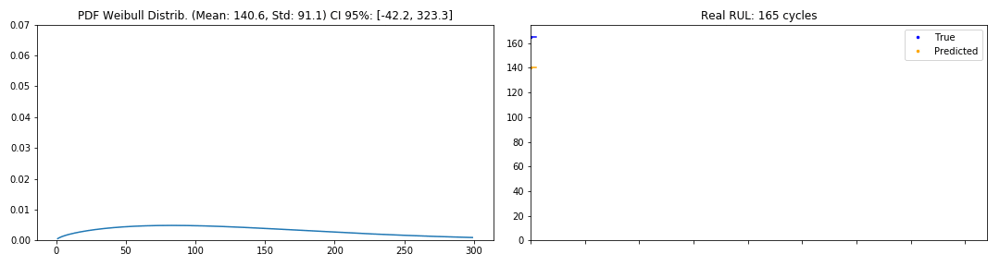
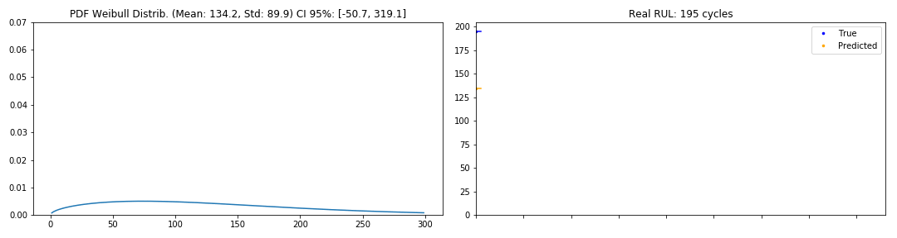
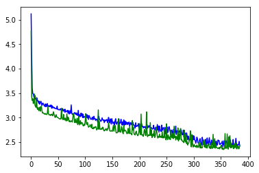
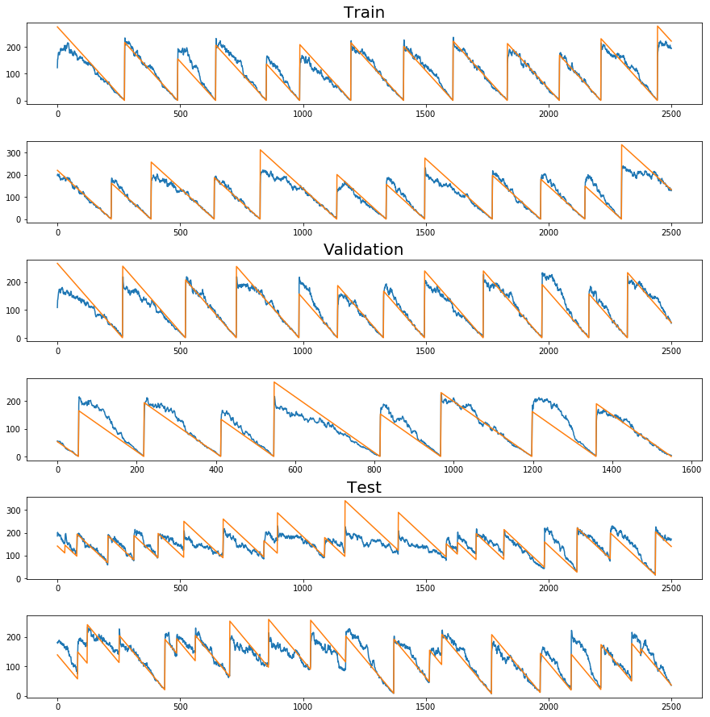
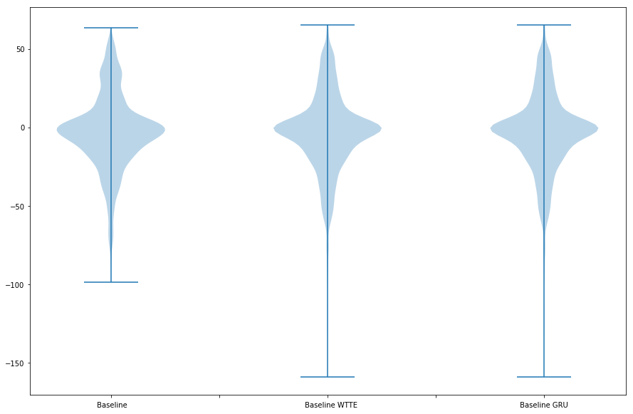

[View in Colaboratory](https://colab.research.google.com/github/Manelmc/rnn-time-to-event/blob/master/predictive-maintenance-turbofan-engine.ipynb)

# Predictive Maintenance for the Turbofan Engine Dataset


## Data Preparation


```python
import keras
import keras.backend as K

print "Keras version", keras.__version__

import pandas as pd
import numpy as np
import matplotlib.pyplot as plt


# Setting seed for reproducibility
SEED = 42
np.random.seed(SEED)  
```

    Using TensorFlow backend.


    Keras version 2.1.6


```python
!mkdir Dataset
!mkdir Models

!wget -q https://raw.githubusercontent.com/Manelmc/rnn-time-to-event/master/Dataset/PM_test.txt -O Dataset/PM_test.txt 
!wget -q https://raw.githubusercontent.com/Manelmc/rnn-time-to-event/master/Dataset/PM_train.txt -O Dataset/PM_train.txt  
!wget -q https://raw.githubusercontent.com/Manelmc/rnn-time-to-event/master/Dataset/PM_truth.txt -O Dataset/PM_truth.txt
  
!ls Dataset
```

    PM_test.txt  PM_train.txt  PM_truth.txt


### Turbofan Train Set


```python
from sklearn import preprocessing

# read training data - It is the aircraft engine run-to-failure data.
train_df = pd.read_csv('Dataset/PM_train.txt', sep=" ", header=None)
train_df.drop(train_df.columns[[26, 27]], axis=1, inplace=True)
train_df.columns = ['id', 'cycle', 'setting1', 'setting2', 'setting3', 's1', 's2', 's3',
                     's4', 's5', 's6', 's7', 's8', 's9', 's10', 's11', 's12', 's13', 's14',
                     's15', 's16', 's17', 's18', 's19', 's20', 's21']

train_df = train_df.sort_values(['id','cycle'])

# Data Labeling - generate column RUL (Remaining Useful Life or Time to Failure)
rul = pd.DataFrame(train_df.groupby('id')['cycle'].max()).reset_index()
rul.columns = ['id', 'max']
train_df = train_df.merge(rul, on=['id'], how='left')
train_df['RUL'] = train_df['max'] - train_df['cycle']
train_df.drop('max', axis=1, inplace=True)

# MinMax normalization (from 0 to 1)
train_df['cycle_norm'] = train_df['cycle']
cols_normalize = train_df.columns.difference(['id','cycle','RUL','label1','label2'])
min_max_scaler = preprocessing.MinMaxScaler()
norm_train_df = pd.DataFrame(min_max_scaler.fit_transform(train_df[cols_normalize]), 
                             columns=cols_normalize, 
                             index=train_df.index)
join_df = train_df[train_df.columns.difference(cols_normalize)].join(norm_train_df)
train_df = join_df.reindex(columns = train_df.columns)

train_df[train_df["id"] == 1].tail()
```


<div>
<style scoped>
    .dataframe tbody tr th:only-of-type {
        vertical-align: middle;
    }

    .dataframe tbody tr th {
        vertical-align: top;
    }

    .dataframe thead th {
        text-align: right;
    }
</style>
<table border="1" class="dataframe">
  <thead>
    <tr style="text-align: right;">
      <th></th>
      <th>id</th>
      <th>cycle</th>
      <th>setting1</th>
      <th>setting2</th>
      <th>setting3</th>
      <th>s1</th>
      <th>s2</th>
      <th>s3</th>
      <th>s4</th>
      <th>s5</th>
      <th>...</th>
      <th>s14</th>
      <th>s15</th>
      <th>s16</th>
      <th>s17</th>
      <th>s18</th>
      <th>s19</th>
      <th>s20</th>
      <th>s21</th>
      <th>RUL</th>
      <th>cycle_norm</th>
    </tr>
  </thead>
  <tbody>
    <tr>
      <th>187</th>
      <td>1</td>
      <td>188</td>
      <td>0.114943</td>
      <td>0.750000</td>
      <td>0.0</td>
      <td>0.0</td>
      <td>0.765060</td>
      <td>0.683235</td>
      <td>0.684166</td>
      <td>0.0</td>
      <td>...</td>
      <td>0.091599</td>
      <td>0.753367</td>
      <td>0.0</td>
      <td>0.666667</td>
      <td>0.0</td>
      <td>0.0</td>
      <td>0.286822</td>
      <td>0.089202</td>
      <td>4</td>
      <td>0.518006</td>
    </tr>
    <tr>
      <th>188</th>
      <td>1</td>
      <td>189</td>
      <td>0.465517</td>
      <td>0.666667</td>
      <td>0.0</td>
      <td>0.0</td>
      <td>0.894578</td>
      <td>0.547853</td>
      <td>0.772451</td>
      <td>0.0</td>
      <td>...</td>
      <td>0.090670</td>
      <td>0.744132</td>
      <td>0.0</td>
      <td>0.583333</td>
      <td>0.0</td>
      <td>0.0</td>
      <td>0.263566</td>
      <td>0.301712</td>
      <td>3</td>
      <td>0.520776</td>
    </tr>
    <tr>
      <th>189</th>
      <td>1</td>
      <td>190</td>
      <td>0.344828</td>
      <td>0.583333</td>
      <td>0.0</td>
      <td>0.0</td>
      <td>0.731928</td>
      <td>0.614345</td>
      <td>0.737677</td>
      <td>0.0</td>
      <td>...</td>
      <td>0.065229</td>
      <td>0.759523</td>
      <td>0.0</td>
      <td>0.833333</td>
      <td>0.0</td>
      <td>0.0</td>
      <td>0.271318</td>
      <td>0.239299</td>
      <td>2</td>
      <td>0.523546</td>
    </tr>
    <tr>
      <th>190</th>
      <td>1</td>
      <td>191</td>
      <td>0.500000</td>
      <td>0.166667</td>
      <td>0.0</td>
      <td>0.0</td>
      <td>0.641566</td>
      <td>0.682799</td>
      <td>0.734639</td>
      <td>0.0</td>
      <td>...</td>
      <td>0.075704</td>
      <td>0.740669</td>
      <td>0.0</td>
      <td>0.500000</td>
      <td>0.0</td>
      <td>0.0</td>
      <td>0.240310</td>
      <td>0.324910</td>
      <td>1</td>
      <td>0.526316</td>
    </tr>
    <tr>
      <th>191</th>
      <td>1</td>
      <td>192</td>
      <td>0.551724</td>
      <td>0.500000</td>
      <td>0.0</td>
      <td>0.0</td>
      <td>0.701807</td>
      <td>0.662089</td>
      <td>0.758778</td>
      <td>0.0</td>
      <td>...</td>
      <td>0.056714</td>
      <td>0.717199</td>
      <td>0.0</td>
      <td>0.666667</td>
      <td>0.0</td>
      <td>0.0</td>
      <td>0.263566</td>
      <td>0.097625</td>
      <td>0</td>
      <td>0.529086</td>
    </tr>
  </tbody>
</table>
<p>5 rows × 28 columns</p>
</div>


### Turbofan Test Set


```python
from sklearn import preprocessing

# read test data - It is the aircraft engine operating data without failure events recorded.
test_df = pd.read_csv('Dataset/PM_test.txt', sep=" ", header=None)
test_df.drop(test_df.columns[[26, 27]], axis=1, inplace=True)
test_df.columns = ['id', 'cycle', 'setting1', 'setting2', 'setting3', 's1', 's2', 's3',
                     's4', 's5', 's6', 's7', 's8', 's9', 's10', 's11', 's12', 's13', 's14',
                     's15', 's16', 's17', 's18', 's19', 's20', 's21']

# MinMax normalization (from 0 to 1)
test_df['cycle_norm'] = test_df['cycle']
norm_test_df = pd.DataFrame(min_max_scaler.transform(test_df[cols_normalize]), 
                            columns=cols_normalize, 
                            index=test_df.index)
test_join_df = test_df[test_df.columns.difference(cols_normalize)].join(norm_test_df)
test_df = test_join_df.reindex(columns = test_df.columns)
test_df = test_df.reset_index(drop=True)

# read ground truth data - It contains the information of true remaining cycles for each engine in the testing data.
truth_df = pd.read_csv('Dataset/PM_truth.txt', sep=" ", header=None)
truth_df.drop(truth_df.columns[[1]], axis=1, inplace=True)

# generate column max for test data
rul = pd.DataFrame(test_df.groupby('id')['cycle'].max()).reset_index()
rul.columns = ['id', 'max']
truth_df.columns = ['more']
truth_df['id'] = truth_df.index + 1
truth_df['max'] = rul['max'] + truth_df['more']
truth_df.drop('more', axis=1, inplace=True)

# generate RUL for test data
test_df = test_df.merge(truth_df, on=['id'], how='left')
test_df['RUL'] = test_df['max'] - test_df['cycle']
test_df.drop('max', axis=1, inplace=True)

test_df[test_df["id"] == 1].tail()
```


<div>
<style scoped>
    .dataframe tbody tr th:only-of-type {
        vertical-align: middle;
    }

    .dataframe tbody tr th {
        vertical-align: top;
    }

    .dataframe thead th {
        text-align: right;
    }
</style>
<table border="1" class="dataframe">
  <thead>
    <tr style="text-align: right;">
      <th></th>
      <th>id</th>
      <th>cycle</th>
      <th>setting1</th>
      <th>setting2</th>
      <th>setting3</th>
      <th>s1</th>
      <th>s2</th>
      <th>s3</th>
      <th>s4</th>
      <th>s5</th>
      <th>...</th>
      <th>s14</th>
      <th>s15</th>
      <th>s16</th>
      <th>s17</th>
      <th>s18</th>
      <th>s19</th>
      <th>s20</th>
      <th>s21</th>
      <th>cycle_norm</th>
      <th>RUL</th>
    </tr>
  </thead>
  <tbody>
    <tr>
      <th>26</th>
      <td>1</td>
      <td>27</td>
      <td>0.459770</td>
      <td>0.583333</td>
      <td>0.0</td>
      <td>0.0</td>
      <td>0.262048</td>
      <td>0.340310</td>
      <td>0.304862</td>
      <td>0.0</td>
      <td>...</td>
      <td>0.140881</td>
      <td>0.479030</td>
      <td>0.0</td>
      <td>0.333333</td>
      <td>0.0</td>
      <td>0.0</td>
      <td>0.565891</td>
      <td>0.688898</td>
      <td>0.072022</td>
      <td>116</td>
    </tr>
    <tr>
      <th>27</th>
      <td>1</td>
      <td>28</td>
      <td>0.626437</td>
      <td>0.916667</td>
      <td>0.0</td>
      <td>0.0</td>
      <td>0.216867</td>
      <td>0.505995</td>
      <td>0.321404</td>
      <td>0.0</td>
      <td>...</td>
      <td>0.180359</td>
      <td>0.469796</td>
      <td>0.0</td>
      <td>0.333333</td>
      <td>0.0</td>
      <td>0.0</td>
      <td>0.534884</td>
      <td>0.629660</td>
      <td>0.074792</td>
      <td>115</td>
    </tr>
    <tr>
      <th>28</th>
      <td>1</td>
      <td>29</td>
      <td>0.580460</td>
      <td>0.583333</td>
      <td>0.0</td>
      <td>0.0</td>
      <td>0.222892</td>
      <td>0.351210</td>
      <td>0.267725</td>
      <td>0.0</td>
      <td>...</td>
      <td>0.171277</td>
      <td>0.370527</td>
      <td>0.0</td>
      <td>0.333333</td>
      <td>0.0</td>
      <td>0.0</td>
      <td>0.682171</td>
      <td>0.646092</td>
      <td>0.077562</td>
      <td>114</td>
    </tr>
    <tr>
      <th>29</th>
      <td>1</td>
      <td>30</td>
      <td>0.356322</td>
      <td>0.833333</td>
      <td>0.0</td>
      <td>0.0</td>
      <td>0.475904</td>
      <td>0.320035</td>
      <td>0.316003</td>
      <td>0.0</td>
      <td>...</td>
      <td>0.179843</td>
      <td>0.331281</td>
      <td>0.0</td>
      <td>0.250000</td>
      <td>0.0</td>
      <td>0.0</td>
      <td>0.736434</td>
      <td>0.707954</td>
      <td>0.080332</td>
      <td>113</td>
    </tr>
    <tr>
      <th>30</th>
      <td>1</td>
      <td>31</td>
      <td>0.465517</td>
      <td>0.833333</td>
      <td>0.0</td>
      <td>0.0</td>
      <td>0.412651</td>
      <td>0.221932</td>
      <td>0.281229</td>
      <td>0.0</td>
      <td>...</td>
      <td>0.155692</td>
      <td>0.298192</td>
      <td>0.0</td>
      <td>0.416667</td>
      <td>0.0</td>
      <td>0.0</td>
      <td>0.519380</td>
      <td>0.636564</td>
      <td>0.083102</td>
      <td>112</td>
    </tr>
  </tbody>
</table>
<p>5 rows × 28 columns</p>
</div>


### Apply right padding to all the sequences


```python
def pad_sequence(df, max_seq_length, mask=0):
    """
    Applies right padding to a sequences until max_seq_length with mask 
    """
    return np.pad(df.values, ((0, max_seq_length - df.values.shape[0]), (0,0)), 
                  "constant", constant_values=mask)
  
def pad_engines(df, cols, max_batch_len, mask=0):
    """
    Applies right padding to the columns "cols" of all the engines 
    """
    return np.array([pad_sequence(df[df['id'] == batch_id][cols], max_batch_len, mask=mask) 
                     for batch_id in df['id'].unique()])
  
max_batch_len = train_df['id'].value_counts().max()
train_cols = ['s' + str(i) for i in range(1,22)] + ['setting1', 'setting2', 'setting3', 'cycle_norm']
test_cols = ["RUL"]

X = pad_engines(train_df, train_cols, max_batch_len)
Y = pad_engines(train_df, test_cols, max_batch_len)
```

### Split into train, validation and test


```python
from sklearn.model_selection import train_test_split

# Split into train and validation
train_X, val_X, train_Y, val_Y = train_test_split(X, Y, test_size=0.20, random_state=SEED)

# Test set from CMAPSS
test_X = pad_engines(test_df, train_cols, max_batch_len)
test_Y = pad_engines(test_df, test_cols, max_batch_len)

# In the WTTE-RNN architecture we will predict 2 parameters (alpha and beta)
# alpha is initialised to 1
train_Y_wtte = np.concatenate((train_Y, np.ones(train_Y.shape)), axis=2)
val_Y_wtte = np.concatenate((val_Y, np.ones(val_Y.shape)), axis=2)
test_Y_wtte = np.concatenate((test_Y, np.ones(test_Y.shape)), axis=2)

print "Train:\n", "  X:", train_X.shape, "\n  Y:", train_Y.shape, "\n  Y_wtte:", train_Y_wtte.shape
print "\nValidation:\n", "  X:", val_X.shape, "\n  Y:", val_Y.shape, "\n  Y_wtte:", val_Y_wtte.shape
print "\nTest:\n", "  X:", test_X.shape, "\n  Y:", test_Y.shape, "\n  Y_wtte:", test_Y_wtte.shape
```

    Train:
      X: (80, 362, 25) 
      Y: (80, 362, 1) 
      Y_wtte: (80, 362, 2)
    
    Validation:
      X: (20, 362, 25) 
      Y: (20, 362, 1) 
      Y_wtte: (20, 362, 2)
    
    Test:
      X: (100, 362, 25) 
      Y: (100, 362, 1) 
      Y_wtte: (100, 362, 2)


## Baseline


```python
from keras.layers import Masking
from keras.layers.core import Activation
from keras.models import Sequential
from keras.layers import Dense, LSTM, TimeDistributed
from keras.callbacks import EarlyStopping, ModelCheckpoint

# Model path
baseline_path = "baseline_model"

# Callbacks
early_stopping = EarlyStopping(monitor='val_loss', 
                               min_delta=0, 
                               patience=30, 
                               verbose=0, 
                               mode='min')
checkpoint = ModelCheckpoint(baseline_path, 
                             monitor='val_loss', 
                             save_best_only=True, 
                             mode='min', 
                             verbose=0)
# dimensions of the model
nb_features = train_X.shape[2]
nb_out = train_Y.shape[2]

model = Sequential()
# Masking layer so the right padding is ignored 
# at each layer of the network 
model.add(Masking(mask_value=0., 
                  input_shape=(max_batch_len, nb_features)))
# Then there s an LSTM layer with 100 units 
# Recurrent Dropout is also applied after each 
# LSTM layer to control overfitting. 
model.add(LSTM(
         units=100,
         recurrent_dropout=0.2,
         return_sequences=True))
# followed by another LSTM layer with 50 units
model.add(LSTM(
         units=50,
         recurrent_dropout=0.2,
         return_sequences=True))
# Final layer is a Time-Distributed Dense layer
# with a single unit with an Exponential activation
model.add(TimeDistributed(Dense(nb_out, activation=K.exp)))
model.compile(loss="mse", optimizer=keras.optimizers.RMSprop())

print(model.summary())

# fit the network
history = model.fit(train_X, train_Y, epochs=500, batch_size=16, 
                    validation_data=(val_X, val_Y), shuffle=True, 
                    verbose=2, callbacks = [early_stopping, checkpoint])

# list all data in history
print(history.history.keys())
```

    _________________________________________________________________
    Layer (type)                 Output Shape              Param #   
    =================================================================
    masking_1 (Masking)          (None, 362, 25)           0         
    _________________________________________________________________
    lstm_1 (LSTM)                (None, 362, 100)          50400     
    _________________________________________________________________
    lstm_2 (LSTM)                (None, 362, 50)           30200     
    _________________________________________________________________
    time_distributed_1 (TimeDist (None, 362, 1)            51        
    =================================================================
    Total params: 80,651
    Trainable params: 80,651
    Non-trainable params: 0
    _________________________________________________________________
    None
    Train on 80 samples, validate on 20 samples
    Epoch 1/500
     - 16s - loss: 15456.0848 - val_loss: 6900.5324
    Epoch 2/500
     - 14s - loss: 6877.5924 - val_loss: 5549.6422
    Epoch 3/500
     - 14s - loss: 6091.0797 - val_loss: 5398.0746
    Epoch 4/500
     - 14s - loss: 5915.1381 - val_loss: 5111.3518
    Epoch 5/500
     - 14s - loss: 5632.8102 - val_loss: 4689.6951
    Epoch 6/500
     - 14s - loss: 5863.0854 - val_loss: 4507.6330
    Epoch 7/500
     - 14s - loss: 5225.4475 - val_loss: 4074.9286
    Epoch 8/500
     - 14s - loss: 4915.9486 - val_loss: 3481.9940
    Epoch 9/500
     - 15s - loss: 4489.0757 - val_loss: 3164.9543
    Epoch 10/500
     - 14s - loss: 5144.5497 - val_loss: 3911.2941
    Epoch 11/500
     - 14s - loss: 4019.4934 - val_loss: 3012.1358
    Epoch 12/500
     - 14s - loss: 4202.3659 - val_loss: 2436.2047
    Epoch 13/500
     - 14s - loss: 3600.0010 - val_loss: 3055.1884
    Epoch 14/500
     - 14s - loss: 4201.0958 - val_loss: 2183.9635
    Epoch 15/500
     - 14s - loss: 3166.8819 - val_loss: 2954.1629
    Epoch 16/500
     - 14s - loss: 4241.7184 - val_loss: 1992.6248
    Epoch 17/500
     - 14s - loss: 2886.7455 - val_loss: 3888.9413
    Epoch 18/500
     - 16s - loss: 3543.3710 - val_loss: 3110.6249
    Epoch 19/500
     - 16s - loss: 3814.2153 - val_loss: 1956.0738
    Epoch 20/500
     - 17s - loss: 3117.3276 - val_loss: 1794.2375
    Epoch 21/500
     - 16s - loss: 2778.8294 - val_loss: 1941.1524
    Epoch 22/500
     - 15s - loss: 3431.2513 - val_loss: 1791.9000
    Epoch 23/500
     - 14s - loss: 2837.7960 - val_loss: 1685.2982
    Epoch 24/500
     - 14s - loss: 3113.6035 - val_loss: 1687.8142
    Epoch 25/500
     - 14s - loss: 3425.9408 - val_loss: 2508.1353
    Epoch 26/500
     - 14s - loss: 2564.3537 - val_loss: 3300.6896
    Epoch 27/500
     - 14s - loss: 3061.6361 - val_loss: 1471.0098
    Epoch 28/500
     - 14s - loss: 3663.0818 - val_loss: 1808.0557
    Epoch 29/500
     - 14s - loss: 2564.8141 - val_loss: 2025.1887
    Epoch 30/500
     - 14s - loss: 2805.5104 - val_loss: 1702.7249
    Epoch 31/500
     - 14s - loss: 2526.1116 - val_loss: 2846.3029
    Epoch 32/500
     - 14s - loss: 2697.8254 - val_loss: 1796.4128
    Epoch 33/500
     - 14s - loss: 2783.9349 - val_loss: 1351.7367
    Epoch 34/500
     - 14s - loss: 2729.6577 - val_loss: 3633.9290
    Epoch 35/500
     - 14s - loss: 2693.2707 - val_loss: 1832.9264
    Epoch 36/500
     - 14s - loss: 2920.7143 - val_loss: 1462.2361
    Epoch 37/500
     - 14s - loss: 2135.7759 - val_loss: 2133.2512
    Epoch 38/500
     - 14s - loss: 2146.4038 - val_loss: 1170.1861
    Epoch 39/500
     - 14s - loss: 2698.1626 - val_loss: 1302.3328
    Epoch 40/500
     - 14s - loss: 2703.4092 - val_loss: 2253.2198
    Epoch 41/500
     - 14s - loss: 2124.5277 - val_loss: 1152.8489
    Epoch 42/500
     - 14s - loss: 2666.7810 - val_loss: 1434.7293
    Epoch 43/500
     - 14s - loss: 2466.3520 - val_loss: 1513.0129
    Epoch 44/500
     - 14s - loss: 2142.4634 - val_loss: 1278.1408
    Epoch 45/500
     - 14s - loss: 2038.5148 - val_loss: 1098.1401
    Epoch 46/500
     - 15s - loss: 3281.8600 - val_loss: 1512.9706
    Epoch 47/500
     - 15s - loss: 2150.2987 - val_loss: 1187.9328
    Epoch 48/500
     - 15s - loss: 2384.1593 - val_loss: 1201.4147
    Epoch 49/500
     - 15s - loss: 2053.4192 - val_loss: 1328.8229
    Epoch 50/500
     - 15s - loss: 2355.5542 - val_loss: 1330.9906
    Epoch 51/500
     - 15s - loss: 2285.0889 - val_loss: 1136.6277
    Epoch 52/500
     - 15s - loss: 2207.2346 - val_loss: 1098.8350
    Epoch 53/500
     - 15s - loss: 2797.0598 - val_loss: 1300.5106
    Epoch 54/500
     - 15s - loss: 1987.7851 - val_loss: 1121.1626
    Epoch 55/500
     - 15s - loss: 2196.4822 - val_loss: 1263.4227
    Epoch 56/500
     - 15s - loss: 2184.2270 - val_loss: 1681.1063
    Epoch 57/500
     - 15s - loss: 2219.0149 - val_loss: 1187.5973
    Epoch 58/500
     - 15s - loss: 1973.5850 - val_loss: 1982.8463
    Epoch 59/500
     - 15s - loss: 2009.7034 - val_loss: 1076.3006
    Epoch 60/500
     - 15s - loss: 2832.7867 - val_loss: 1387.2842
    Epoch 61/500
     - 14s - loss: 2080.6540 - val_loss: 1032.8452
    Epoch 62/500
     - 14s - loss: 2121.1385 - val_loss: 1021.0964
    Epoch 63/500
     - 14s - loss: 2195.2374 - val_loss: 1132.4235
    Epoch 64/500
     - 14s - loss: 2080.7740 - val_loss: 1545.7530
    Epoch 65/500
     - 14s - loss: 2110.8936 - val_loss: 1141.1328
    Epoch 66/500
     - 14s - loss: 2408.2546 - val_loss: 989.0239
    Epoch 67/500
     - 14s - loss: 2067.2626 - val_loss: 1159.1314
    Epoch 68/500
     - 14s - loss: 2002.4949 - val_loss: 2119.9111
    Epoch 69/500
     - 14s - loss: 2868.4675 - val_loss: 1424.8434
    Epoch 70/500
     - 13s - loss: 1896.0866 - val_loss: 1414.9314
    Epoch 71/500
     - 14s - loss: 2075.9521 - val_loss: 981.4218
    Epoch 72/500
     - 14s - loss: 1889.7083 - val_loss: 1674.6128
    Epoch 73/500
     - 14s - loss: 2018.1434 - val_loss: 1047.3691
    Epoch 74/500
     - 14s - loss: 2059.4452 - val_loss: 1332.4160
    Epoch 75/500
     - 14s - loss: 1952.0875 - val_loss: 1558.0453
    Epoch 76/500
     - 14s - loss: 2278.4795 - val_loss: 1065.9976
    Epoch 77/500
     - 14s - loss: 2045.6946 - val_loss: 1108.1710
    Epoch 78/500
     - 14s - loss: 1963.4405 - val_loss: 1001.2775
    Epoch 79/500
     - 15s - loss: 2077.8761 - val_loss: 956.0796
    Epoch 80/500
     - 15s - loss: 1993.9135 - val_loss: 1903.9658
    Epoch 81/500
     - 15s - loss: 2188.9351 - val_loss: 1152.4972
    Epoch 82/500
     - 15s - loss: 2534.0871 - val_loss: 1639.6524
    Epoch 83/500
     - 15s - loss: 1909.3100 - val_loss: 928.7146
    Epoch 84/500
     - 15s - loss: 1901.0579 - val_loss: 1518.1974
    Epoch 85/500
     - 15s - loss: 1991.4355 - val_loss: 1002.4967
    Epoch 86/500
     - 15s - loss: 2058.8263 - val_loss: 1012.2861
    Epoch 87/500
     - 15s - loss: 1708.5906 - val_loss: 1067.2433
    Epoch 88/500
     - 15s - loss: 2349.2910 - val_loss: 1024.5008
    Epoch 89/500
     - 15s - loss: 2041.4616 - val_loss: 1534.2663
    Epoch 90/500
     - 15s - loss: 1908.5405 - val_loss: 1052.0235
    Epoch 91/500
     - 15s - loss: 1996.0556 - val_loss: 932.5347
    Epoch 92/500
     - 14s - loss: 2128.6324 - val_loss: 1131.6007
    Epoch 93/500
     - 14s - loss: 1817.4954 - val_loss: 2273.3291
    Epoch 94/500
     - 15s - loss: 2057.5656 - val_loss: 1100.6870
    Epoch 95/500
     - 16s - loss: 1738.2069 - val_loss: 1854.9611
    Epoch 96/500
     - 14s - loss: 1800.8940 - val_loss: 1177.8108
    Epoch 97/500
     - 15s - loss: 1960.9618 - val_loss: 1639.8827
    Epoch 98/500
     - 17s - loss: 1880.6043 - val_loss: 860.2317
    Epoch 99/500
     - 14s - loss: 1735.9890 - val_loss: 880.6968
    Epoch 100/500
     - 14s - loss: 1836.6793 - val_loss: 1424.9322
    Epoch 101/500
     - 14s - loss: 2151.1263 - val_loss: 1175.1337
    Epoch 102/500
     - 14s - loss: 1795.2555 - val_loss: 1215.1604
    Epoch 103/500
     - 14s - loss: 1920.7502 - val_loss: 886.7352
    Epoch 104/500
     - 14s - loss: 1985.4240 - val_loss: 1296.4597
    Epoch 105/500
     - 14s - loss: 1822.4241 - val_loss: 996.1542
    Epoch 106/500
     - 14s - loss: 1881.5269 - val_loss: 942.6683
    Epoch 107/500
     - 14s - loss: 1788.1725 - val_loss: 1429.5947
    Epoch 108/500
     - 14s - loss: 1833.2312 - val_loss: 915.1230
    Epoch 109/500
     - 14s - loss: 1742.2646 - val_loss: 1595.9142
    Epoch 110/500
     - 14s - loss: 1794.6271 - val_loss: 1179.9189
    Epoch 111/500
     - 14s - loss: 1981.4699 - val_loss: 1693.2388
    Epoch 112/500
     - 14s - loss: 2082.6482 - val_loss: 977.6343
    Epoch 113/500
     - 14s - loss: 1825.2175 - val_loss: 865.5171
    Epoch 114/500
     - 14s - loss: 1524.8149 - val_loss: 1069.2405
    Epoch 115/500
     - 14s - loss: 1905.1582 - val_loss: 1199.7133
    Epoch 116/500
     - 14s - loss: 1863.0009 - val_loss: 940.1206
    Epoch 117/500
     - 15s - loss: 1788.2269 - val_loss: 1205.9330
    Epoch 118/500
     - 14s - loss: 1980.0966 - val_loss: 906.0334
    Epoch 119/500
     - 14s - loss: 1574.0656 - val_loss: 1230.5924
    Epoch 120/500
     - 14s - loss: 2100.7064 - val_loss: 920.7429
    Epoch 121/500
     - 14s - loss: 1804.7077 - val_loss: 947.1101
    Epoch 122/500
     - 14s - loss: 1666.2796 - val_loss: 869.2439
    Epoch 123/500
     - 14s - loss: 1633.2327 - val_loss: 953.5885
    Epoch 124/500
     - 14s - loss: 1918.0873 - val_loss: 903.1507
    Epoch 125/500
     - 15s - loss: 1952.4667 - val_loss: 956.5563
    Epoch 126/500
     - 15s - loss: 1807.7807 - val_loss: 820.6631
    Epoch 127/500
     - 15s - loss: 1668.0876 - val_loss: 1325.6414
    Epoch 128/500
     - 15s - loss: 1871.9919 - val_loss: 808.4215
    Epoch 129/500
     - 15s - loss: 1689.1806 - val_loss: 849.7390
    Epoch 130/500
     - 15s - loss: 1641.9164 - val_loss: 858.0607
    Epoch 131/500
     - 15s - loss: 1610.2184 - val_loss: 945.8604
    Epoch 132/500
     - 15s - loss: 1691.4038 - val_loss: 1269.7585
    Epoch 133/500
     - 14s - loss: 1891.9877 - val_loss: 1025.7560
    Epoch 134/500
     - 14s - loss: 1598.7779 - val_loss: 861.9136
    Epoch 135/500
     - 14s - loss: 1608.3951 - val_loss: 853.3064
    Epoch 136/500
     - 15s - loss: 1792.5105 - val_loss: 994.1826
    Epoch 137/500
     - 15s - loss: 1683.1178 - val_loss: 1305.9822
    Epoch 138/500
     - 15s - loss: 1661.8575 - val_loss: 1599.7714
    Epoch 139/500
     - 14s - loss: 1963.7007 - val_loss: 801.8957
    Epoch 140/500
     - 14s - loss: 1603.0608 - val_loss: 939.9515
    Epoch 141/500
     - 13s - loss: 1628.3844 - val_loss: 1449.2199
    Epoch 142/500
     - 14s - loss: 1815.2978 - val_loss: 1050.7938
    Epoch 143/500
     - 14s - loss: 1567.9977 - val_loss: 1589.0944
    Epoch 144/500
     - 15s - loss: 1800.5091 - val_loss: 842.4744
    Epoch 145/500
     - 15s - loss: 1802.5672 - val_loss: 895.4380
    Epoch 146/500
     - 14s - loss: 1568.5664 - val_loss: 831.4081
    Epoch 147/500
     - 14s - loss: 1543.9244 - val_loss: 811.5477
    Epoch 148/500
     - 14s - loss: 1631.9594 - val_loss: 1365.1522
    Epoch 149/500
     - 14s - loss: 1861.7292 - val_loss: 1020.2770
    Epoch 150/500
     - 14s - loss: 1646.7908 - val_loss: 1071.0774
    Epoch 151/500
     - 13s - loss: 1530.9719 - val_loss: 792.5181
    Epoch 152/500
     - 14s - loss: 1464.9539 - val_loss: 884.0077
    Epoch 153/500
     - 14s - loss: 1527.1920 - val_loss: 795.1847
    Epoch 154/500
     - 14s - loss: 1497.5370 - val_loss: 1477.4790
    Epoch 155/500
     - 14s - loss: 1847.0915 - val_loss: 893.8424
    Epoch 156/500
     - 14s - loss: 1588.9678 - val_loss: 781.5552
    Epoch 157/500
     - 14s - loss: 1605.5993 - val_loss: 887.9926
    Epoch 158/500
     - 15s - loss: 1955.0820 - val_loss: 898.6046
    Epoch 159/500
     - 14s - loss: 1672.8784 - val_loss: 760.3624
    Epoch 160/500
     - 15s - loss: 1596.6111 - val_loss: 990.9718
    Epoch 161/500
     - 15s - loss: 1715.3929 - val_loss: 1232.2667
    Epoch 162/500
     - 14s - loss: 1618.9168 - val_loss: 890.9311
    Epoch 163/500
     - 14s - loss: 1581.6440 - val_loss: 953.4282
    Epoch 164/500
     - 14s - loss: 1684.7069 - val_loss: 1139.9655
    Epoch 165/500
     - 14s - loss: 1615.5339 - val_loss: 799.8180
    Epoch 166/500
     - 14s - loss: 1669.7489 - val_loss: 1008.5012
    Epoch 167/500
     - 14s - loss: 1693.1449 - val_loss: 814.4432
    Epoch 168/500
     - 14s - loss: 1701.8799 - val_loss: 908.1206
    Epoch 169/500
     - 15s - loss: 1540.4425 - val_loss: 1134.7724
    Epoch 170/500
     - 14s - loss: 1649.1713 - val_loss: 763.1190
    Epoch 171/500
     - 15s - loss: 1605.8917 - val_loss: 852.0386
    Epoch 172/500
     - 14s - loss: 1595.6228 - val_loss: 1288.7676
    Epoch 173/500
     - 14s - loss: 1504.3230 - val_loss: 1420.4645
    Epoch 174/500
     - 17s - loss: 1535.4419 - val_loss: 798.8063
    Epoch 175/500
     - 14s - loss: 1591.0242 - val_loss: 1076.4373
    Epoch 176/500
     - 15s - loss: 1593.9819 - val_loss: 1219.9768
    Epoch 177/500
     - 15s - loss: 1778.2807 - val_loss: 966.2337
    Epoch 178/500
     - 15s - loss: 1551.7066 - val_loss: 792.8171
    Epoch 179/500
     - 14s - loss: 1455.7331 - val_loss: 766.3919
    Epoch 180/500
     - 14s - loss: 1782.7215 - val_loss: 1457.6005
    Epoch 181/500
     - 15s - loss: 1825.3866 - val_loss: 770.2269
    Epoch 182/500
     - 14s - loss: 1444.4748 - val_loss: 984.4170
    Epoch 183/500
     - 14s - loss: 1514.2058 - val_loss: 866.5793
    Epoch 184/500
     - 14s - loss: 1724.7832 - val_loss: 744.9367
    Epoch 185/500
     - 14s - loss: 1606.8322 - val_loss: 810.2349
    Epoch 186/500
     - 14s - loss: 1613.9417 - val_loss: 1831.5153
    Epoch 187/500
     - 14s - loss: 1916.8406 - val_loss: 1064.6094
    Epoch 188/500
     - 14s - loss: 1451.5645 - val_loss: 773.1017
    Epoch 189/500
     - 14s - loss: 1428.4564 - val_loss: 751.2208
    Epoch 190/500
     - 14s - loss: 1513.2068 - val_loss: 1206.2878
    Epoch 191/500
     - 14s - loss: 1520.7077 - val_loss: 895.0643
    Epoch 192/500
     - 14s - loss: 1653.8503 - val_loss: 846.0882
    Epoch 193/500
     - 14s - loss: 1297.7669 - val_loss: 1038.9138
    Epoch 194/500
     - 14s - loss: 1596.3148 - val_loss: 711.6981
    Epoch 195/500
     - 14s - loss: 1453.2563 - val_loss: 929.0120
    Epoch 196/500
     - 14s - loss: 1385.4462 - val_loss: 1314.4691
    Epoch 197/500
     - 14s - loss: 2078.7028 - val_loss: 763.6002
    Epoch 198/500
     - 14s - loss: 1525.7077 - val_loss: 1036.1085
    Epoch 199/500
     - 14s - loss: 1486.5060 - val_loss: 768.7481
    Epoch 200/500
     - 14s - loss: 1419.1720 - val_loss: 874.5163
    Epoch 201/500
     - 14s - loss: 1533.1558 - val_loss: 909.7182
    Epoch 202/500
     - 14s - loss: 1660.0583 - val_loss: 743.6639
    Epoch 203/500
     - 14s - loss: 1467.1095 - val_loss: 794.6139
    Epoch 204/500
     - 14s - loss: 1463.1776 - val_loss: 818.8793
    Epoch 205/500
     - 14s - loss: 1352.6700 - val_loss: 774.9599
    Epoch 206/500
     - 14s - loss: 1550.7807 - val_loss: 1566.1727
    Epoch 207/500
     - 14s - loss: 1643.7603 - val_loss: 846.0066
    Epoch 208/500
     - 14s - loss: 1307.9172 - val_loss: 729.8231
    Epoch 209/500
     - 14s - loss: 1474.8942 - val_loss: 736.8128
    Epoch 210/500
     - 14s - loss: 2068.4421 - val_loss: 792.4761
    Epoch 211/500
     - 14s - loss: 1445.4898 - val_loss: 756.9840
    Epoch 212/500
     - 14s - loss: 1497.2402 - val_loss: 880.5357
    Epoch 213/500
     - 14s - loss: 1477.4796 - val_loss: 795.5878
    Epoch 214/500
     - 14s - loss: 1662.3244 - val_loss: 731.3383
    Epoch 215/500
     - 14s - loss: 1497.3619 - val_loss: 760.6690
    Epoch 216/500
     - 14s - loss: 1634.1677 - val_loss: 912.2022
    Epoch 217/500
     - 14s - loss: 1383.6990 - val_loss: 790.9603
    Epoch 218/500
     - 14s - loss: 1321.9302 - val_loss: 957.7168
    Epoch 219/500
     - 14s - loss: 1784.2190 - val_loss: 935.3508
    Epoch 220/500
     - 14s - loss: 1671.3392 - val_loss: 834.2459
    Epoch 221/500
     - 14s - loss: 1414.7299 - val_loss: 707.9848
    Epoch 222/500
     - 14s - loss: 1360.2001 - val_loss: 814.9311
    Epoch 223/500
     - 14s - loss: 1624.1479 - val_loss: 1072.5425
    Epoch 224/500
     - 14s - loss: 1541.6627 - val_loss: 713.4978
    Epoch 225/500
     - 14s - loss: 1421.6972 - val_loss: 802.0563
    Epoch 226/500
     - 14s - loss: 1511.6379 - val_loss: 784.2710
    Epoch 227/500
     - 14s - loss: 1327.1338 - val_loss: 714.6176
    Epoch 228/500
     - 14s - loss: 1444.1746 - val_loss: 775.6749
    Epoch 229/500
     - 14s - loss: 1338.6644 - val_loss: 756.9915
    Epoch 230/500
     - 14s - loss: 1618.6288 - val_loss: 1056.2695
    Epoch 231/500
     - 14s - loss: 1388.1222 - val_loss: 766.1976
    Epoch 232/500
     - 14s - loss: 1377.1297 - val_loss: 719.7286
    Epoch 233/500
     - 14s - loss: 1445.6112 - val_loss: 735.2935
    Epoch 234/500
     - 14s - loss: 1467.5156 - val_loss: 783.1363
    Epoch 235/500
     - 14s - loss: 1422.8511 - val_loss: 756.6021
    Epoch 236/500
     - 15s - loss: 1339.5396 - val_loss: 809.7018
    Epoch 237/500
     - 15s - loss: 1632.8337 - val_loss: 871.2125
    Epoch 238/500
     - 15s - loss: 1489.3318 - val_loss: 733.4811
    Epoch 239/500
     - 15s - loss: 1319.7481 - val_loss: 1132.6681
    Epoch 240/500
     - 15s - loss: 1420.2991 - val_loss: 821.4930
    Epoch 241/500
     - 15s - loss: 1840.0255 - val_loss: 768.4618
    Epoch 242/500
     - 15s - loss: 1524.4902 - val_loss: 848.4488
    Epoch 243/500
     - 15s - loss: 1445.1857 - val_loss: 688.8927
    Epoch 244/500
     - 14s - loss: 1562.4505 - val_loss: 985.0061
    Epoch 245/500
     - 15s - loss: 1459.4946 - val_loss: 820.7444
    Epoch 246/500
     - 15s - loss: 1584.6831 - val_loss: 700.0040
    Epoch 247/500
     - 15s - loss: 1511.3584 - val_loss: 673.1445
    Epoch 248/500
     - 14s - loss: 1329.9802 - val_loss: 812.0419
    Epoch 249/500
     - 15s - loss: 1621.9026 - val_loss: 863.3993
    Epoch 250/500
     - 15s - loss: 1376.6295 - val_loss: 752.3784
    Epoch 251/500
     - 15s - loss: 1320.6914 - val_loss: 671.0575
    Epoch 252/500
     - 16s - loss: 1598.7011 - val_loss: 685.1022
    Epoch 253/500
     - 16s - loss: 1421.0932 - val_loss: 664.0350
    Epoch 254/500
     - 16s - loss: 1340.4524 - val_loss: 794.8535
    Epoch 255/500
     - 16s - loss: 1468.8290 - val_loss: 1025.1562
    Epoch 256/500
     - 14s - loss: 1349.0921 - val_loss: 664.1220
    Epoch 257/500
     - 15s - loss: 1303.5884 - val_loss: 740.5696
    Epoch 258/500
     - 14s - loss: 1258.3241 - val_loss: 767.5505
    Epoch 259/500
     - 15s - loss: 1307.3620 - val_loss: 613.0309
    Epoch 260/500
     - 14s - loss: 1457.6495 - val_loss: 683.7624
    Epoch 261/500
     - 14s - loss: 1284.1277 - val_loss: 689.9631
    Epoch 262/500
     - 14s - loss: 1442.3814 - val_loss: 793.3374
    Epoch 263/500
     - 14s - loss: 1397.6451 - val_loss: 670.0701
    Epoch 264/500
     - 14s - loss: 1468.1257 - val_loss: 654.8350
    Epoch 265/500
     - 15s - loss: 1354.6847 - val_loss: 649.9236
    Epoch 266/500
     - 14s - loss: 1474.4312 - val_loss: 706.1800
    Epoch 267/500
     - 14s - loss: 1200.9987 - val_loss: 733.6614
    Epoch 268/500
     - 15s - loss: 1290.3411 - val_loss: 654.3727
    Epoch 269/500
     - 14s - loss: 1440.2821 - val_loss: 691.9584
    Epoch 270/500
     - 14s - loss: 1441.7219 - val_loss: 681.1638
    Epoch 271/500
     - 14s - loss: 1127.9098 - val_loss: 859.2968
    Epoch 272/500
     - 14s - loss: 1547.4247 - val_loss: 921.2890
    Epoch 273/500
     - 14s - loss: 1410.6108 - val_loss: 684.6277
    Epoch 274/500
     - 14s - loss: 1262.9887 - val_loss: 674.8512
    Epoch 275/500
     - 14s - loss: 1240.8438 - val_loss: 676.6880
    Epoch 276/500
     - 14s - loss: 1490.6218 - val_loss: 647.3917
    Epoch 277/500
     - 14s - loss: 1561.5792 - val_loss: 660.8745
    Epoch 278/500
     - 14s - loss: 1460.6762 - val_loss: 736.5406
    Epoch 279/500
     - 14s - loss: 1314.0010 - val_loss: 734.6058
    Epoch 280/500
     - 14s - loss: 1527.6039 - val_loss: 1113.2005
    Epoch 281/500
     - 14s - loss: 1456.2508 - val_loss: 1043.6322
    Epoch 282/500
     - 14s - loss: 1390.5686 - val_loss: 599.7193
    Epoch 283/500
     - 14s - loss: 1330.6769 - val_loss: 687.5731
    Epoch 284/500
     - 14s - loss: 1196.6431 - val_loss: 626.7072
    Epoch 285/500
     - 14s - loss: 1318.2885 - val_loss: 638.5431
    Epoch 286/500
     - 14s - loss: 1303.8163 - val_loss: 706.8192
    Epoch 287/500
     - 14s - loss: 1413.0276 - val_loss: 629.1196
    Epoch 288/500
     - 14s - loss: 1209.9435 - val_loss: 568.6697
    Epoch 289/500
     - 14s - loss: 1494.5448 - val_loss: 910.1398
    Epoch 290/500
     - 15s - loss: 1395.7045 - val_loss: 726.2437
    Epoch 291/500
     - 14s - loss: 1238.0876 - val_loss: 661.5640
    Epoch 292/500
     - 14s - loss: 1249.6325 - val_loss: 1144.6583
    Epoch 293/500
     - 14s - loss: 1480.4237 - val_loss: 681.8846
    Epoch 294/500
     - 14s - loss: 1479.9716 - val_loss: 741.6296
    Epoch 295/500
     - 14s - loss: 1288.8079 - val_loss: 605.3892
    Epoch 296/500
     - 14s - loss: 1249.6753 - val_loss: 623.8641
    Epoch 297/500
     - 14s - loss: 1360.1743 - val_loss: 948.2613
    Epoch 298/500
     - 14s - loss: 1304.7552 - val_loss: 651.8308
    Epoch 299/500
     - 14s - loss: 1463.8563 - val_loss: 677.7308
    Epoch 300/500
     - 14s - loss: 1371.9036 - val_loss: 801.7787
    Epoch 301/500
     - 14s - loss: 1395.5272 - val_loss: 1047.4796
    Epoch 302/500
     - 14s - loss: 1342.1587 - val_loss: 664.3130
    Epoch 303/500
     - 14s - loss: 1223.8469 - val_loss: 873.5779
    Epoch 304/500
     - 14s - loss: 1361.0037 - val_loss: 675.7098
    Epoch 305/500
     - 14s - loss: 1151.6466 - val_loss: 696.8724
    Epoch 306/500
     - 14s - loss: 1160.6421 - val_loss: 648.5619
    Epoch 307/500
     - 14s - loss: 1364.8920 - val_loss: 708.9250
    Epoch 308/500
     - 14s - loss: 1145.8300 - val_loss: 684.7579
    Epoch 309/500
     - 15s - loss: 1483.2823 - val_loss: 665.0914
    Epoch 310/500
     - 15s - loss: 1484.7324 - val_loss: 676.9185
    Epoch 311/500
     - 15s - loss: 1204.1237 - val_loss: 621.4485
    Epoch 312/500
     - 15s - loss: 1293.4628 - val_loss: 611.2367
    Epoch 313/500
     - 15s - loss: 1410.6540 - val_loss: 599.2881
    Epoch 314/500
     - 15s - loss: 1280.4136 - val_loss: 651.2672
    Epoch 315/500
     - 15s - loss: 1233.0307 - val_loss: 634.8255
    Epoch 316/500
     - 15s - loss: 1339.8630 - val_loss: 702.0963
    Epoch 317/500
     - 14s - loss: 1249.2757 - val_loss: 789.5427
    Epoch 318/500
     - 15s - loss: 1364.1424 - val_loss: 834.3046
    ['loss', 'val_loss']


```python
# Execute if training in Colaboratory (preferably from Chrome)
# Downloads the model after the training finishes

from google.colab import files
files.download(baseline_path)

# Move the model to the expected folder
!mv baseline_path Models/
```


```python
# Validation loss vs the Training loss

%matplotlib inline

plt.plot(history.history["loss"])
plt.plot(history.history["val_loss"])
```


    [<matplotlib.lines.Line2D at 0x7f6039681c50>]


```python
# Execute if you want to upload a model to Collaboratory

from google.colab import files
uploaded = files.upload()

for fn in uploaded.keys():
    print('User uploaded file "{name}" with length {length} bytes'.format(
      name=fn, length=len(uploaded[fn])))
```


     <input type="file" id="files-f6e556f7-746f-4e94-b68a-9859a114544e" name="files[]" multiple disabled />
     <output id="result-f6e556f7-746f-4e94-b68a-9859a114544e">
      Upload widget is only available when the cell has been executed in the
      current browser session. Please rerun this cell to enable.
      </output>
      <script src="/nbextensions/google.colab/files.js"></script> 


```python
from keras.models import load_model

# It's important to load the model after the training
# The keras Checkpoint will save the best model in terms
# of the validation loss in the specified path
model = load_model("Models/" + baseline_path, custom_objects={"exp": K.exp})
```


```python
%matplotlib inline
from math import sqrt

from sklearn.metrics import mean_squared_error, mean_absolute_error, r2_score

# We save the validation errors to later compare the models
validation_baseline = model.predict(val_X).flatten()

def evaluate_and_plot(model, evaluation_data, weibull_function=None):
    """
    Generate scores dataframe and plot the RUL
    """
    fig = plt.figure()
    i = 1
    score_df = pd.DataFrame({"Method": ["MAE", "RMSE", "R2"]})
    for name_set, train_set, test_set in evaluation_data:
        if weibull_function is None:
            y_pred = model.predict(train_set).flatten()
        else:
            y_pred = [weibull_function(alpha, beta) 
                      for batch in model.predict(train_set) 
                      for beta, alpha in batch]
        l = test_set[:,:,0].flatten()
        # To validate we remove the right padding
        y_true = np.ma.compressed(np.ma.masked_where(l==0, l))
        y_pred = np.ma.compressed(np.ma.masked_where(l==0, y_pred))
        score_mae = "{0:.2f}".format(mean_absolute_error(y_true, y_pred))
        score_rmse = "{0:.2f}".format(sqrt(mean_squared_error(y_true, y_pred)))
        score_r2 = "{0:.3f}".format(r2_score(y_true, y_pred))
        score_df[name_set] = [score_mae, score_rmse, score_r2]
        ax = fig.add_subplot(6, 1, i)
        ax.title.set_text(name_set)
        ax.title.set_fontsize(20)
        i += 1
        plt.plot(y_pred[0:2500])
        plt.plot(y_true[0:2500])
        ax = fig.add_subplot(6, 1, i)
        i += 1
        plt.plot(y_pred[2500:5000])
        plt.plot(y_true[2500:5000])
    plt.subplots_adjust(hspace=0.45)
    fig.set_size_inches(15, i*2.2)
    return score_df.T

evaluate_and_plot(model,
                  [("Train", train_X, train_Y), 
                   ("Validation", val_X, val_Y), 
                   ("Test", test_X, test_Y)])
```


<div>
<style scoped>
    .dataframe tbody tr th:only-of-type {
        vertical-align: middle;
    }

    .dataframe tbody tr th {
        vertical-align: top;
    }

    .dataframe thead th {
        text-align: right;
    }
</style>
<table border="1" class="dataframe">
  <thead>
    <tr style="text-align: right;">
      <th></th>
      <th>0</th>
      <th>1</th>
      <th>2</th>
    </tr>
  </thead>
  <tbody>
    <tr>
      <th>Method</th>
      <td>MAE</td>
      <td>RMSE</td>
      <td>R2</td>
    </tr>
    <tr>
      <th>Train</th>
      <td>21.19</td>
      <td>33.57</td>
      <td>0.766</td>
    </tr>
    <tr>
      <th>Validation</th>
      <td>17.36</td>
      <td>23.98</td>
      <td>0.866</td>
    </tr>
    <tr>
      <th>Test</th>
      <td>27.03</td>
      <td>37.41</td>
      <td>0.598</td>
    </tr>
  </tbody>
</table>
</div>


## Adapting to WTTE-RNN


```python
# Install wtte package from Martinsson

!pip install wtte
```

    Collecting wtte
      Downloading https://files.pythonhosted.org/packages/95/0e/8affc53f47d4ceb69fc80484fd87ad886c6cab7f4ce0add38076b6092d76/wtte-1.1.1-py2.py3-none-any.whl
    Requirement already satisfied: scipy in /usr/local/lib/python2.7/dist-packages (from wtte) (0.19.1)
    Requirement already satisfied: numpy in /usr/local/lib/python2.7/dist-packages (from wtte) (1.14.5)
    Requirement already satisfied: keras>=2.0 in /usr/local/lib/python2.7/dist-packages (from wtte) (2.1.6)
    Requirement already satisfied: pandas in /usr/local/lib/python2.7/dist-packages (from wtte) (0.22.0)
    Collecting six==1.10.0 (from wtte)
      Downloading https://files.pythonhosted.org/packages/c8/0a/b6723e1bc4c516cb687841499455a8505b44607ab535be01091c0f24f079/six-1.10.0-py2.py3-none-any.whl
    Requirement already satisfied: pyyaml in /usr/local/lib/python2.7/dist-packages (from keras>=2.0->wtte) (3.13)
    Requirement already satisfied: h5py in /usr/local/lib/python2.7/dist-packages (from keras>=2.0->wtte) (2.8.0)
    Requirement already satisfied: pytz>=2011k in /usr/local/lib/python2.7/dist-packages (from pandas->wtte) (2018.5)
    Requirement already satisfied: python-dateutil in /usr/local/lib/python2.7/dist-packages (from pandas->wtte) (2.5.3)
    Installing collected packages: six, wtte
      Found existing installation: six 1.11.0
        Uninstalling six-1.11.0:
          Successfully uninstalled six-1.11.0
    Successfully installed six-1.10.0 wtte-1.1.1


```python
# Loss and activation functions from Martinsson
# These are not used in the final version because 
# the wtte package has useful regularization tools

def weibull_loglik_discrete(y_true, y_pred, epsilon=K.epsilon()):
    y = y_true[..., 0]
    u = y_true[..., 1]
    a = y_pred[..., 0]
    b = y_pred[..., 1]
    
    hazard0 = K.pow((y + epsilon) / a, b)
    hazard1 = K.pow((y + 1.0) / a, b)

    loss = u * K.log(K.exp(hazard1 - hazard0) - (1.0 - epsilon)) - hazard1
    return -loss

def activation_weibull(y_true):
    a = y_true[..., 0]
    b = y_true[..., 1]
    
    a = K.exp(a)
    b = K.sigmoid(b)
    return K.stack([a, b], axis=-1)
```


```python
from keras.layers import Masking
from keras.layers.core import Activation
from keras.models import Sequential
from keras.layers import Dense, LSTM, TimeDistributed, Lambda
from keras.callbacks import EarlyStopping, TerminateOnNaN, ModelCheckpoint
import wtte.weibull as weibull
import wtte.wtte as wtte

# Since we use a lambda in the last layer the model 
# is not saved well in keras, instead we save the weights.
# This requires compiling the model to load the weights
baseline_wtte_path = "baseline_wtte_model_weights"
# Callbacks
early_stopping = EarlyStopping(monitor='val_loss', 
                               min_delta=0, 
                               patience=30, 
                               verbose=0, 
                               mode='min')
checkpoint = ModelCheckpoint(baseline_wtte_path, 
                             monitor='val_loss', 
                             save_best_only=True, 
                             save_weights_only=True, 
                             mode='min', 
                             verbose=0)

nb_features = train_X.shape[2]
nb_out = train_Y.shape[1]

model = Sequential()

model.add(Masking(mask_value=0.,
                  input_shape=(max_batch_len, nb_features)))
model.add(LSTM(
         input_shape=(None, nb_features),
         units=100,
         recurrent_dropout=0.2,
         return_sequences=True))
model.add(LSTM(
          units=50,
          recurrent_dropout=0.2,
          return_sequences=True))
model.add(TimeDistributed(Dense(2)))
# uncomment this line and comment the next to use 
# activation_weibull function:
# model.add(Activation(activation_weibull))
model.add(Lambda(wtte.output_lambda, 
                 arguments={# Initialization value around it's scale
                            "init_alpha": np.nanmean(train_Y_wtte[:,0]), 
                            # Set a maximum
                            "max_beta_value": 10.0
                           },
                ))
# Same for the loss "weibull_loglik_discrete"
# model.compile(loss=weibull_loglik_discrete, optimizer='rmsprop')
# We use clipping on the loss
loss = wtte.Loss(kind='discrete', clip_prob=1e-5).loss_function

model.compile(loss=loss, optimizer='rmsprop')
```


```python
print(model.summary())

# fit the network
history = model.fit(train_X, train_Y_wtte, epochs=500, batch_size=16, 
                    validation_data=(val_X, val_Y_wtte), shuffle=True, verbose=2,
                    callbacks = [early_stopping, checkpoint, TerminateOnNaN()])

# list all data in history
print(history.history.keys())
```

    _________________________________________________________________
    Layer (type)                 Output Shape              Param #   
    =================================================================
    masking_4 (Masking)          (None, None, 25)          0         
    _________________________________________________________________
    lstm_7 (LSTM)                (None, None, 100)         50400     
    _________________________________________________________________
    lstm_8 (LSTM)                (None, None, 50)          30200     
    _________________________________________________________________
    time_distributed_4 (TimeDist (None, None, 2)           102       
    _________________________________________________________________
    lambda_2 (Lambda)            (None, None, 2)           0         
    =================================================================
    Total params: 80,702
    Trainable params: 80,702
    Non-trainable params: 0
    _________________________________________________________________
    None
    Train on 80 samples, validate on 20 samples
    Epoch 1/500
     - 15s - loss: 4.3735 - val_loss: 3.7142
    Epoch 2/500
     - 13s - loss: 3.8081 - val_loss: 3.3893
    Epoch 3/500
     - 12s - loss: 3.9081 - val_loss: 3.4282
    Epoch 4/500
     - 12s - loss: 3.4884 - val_loss: 3.2976
    Epoch 5/500
     - 13s - loss: 3.3797 - val_loss: 3.2179
    Epoch 6/500
     - 12s - loss: 3.3757 - val_loss: 3.1918
    Epoch 7/500
     - 13s - loss: 3.2742 - val_loss: 3.1036
    Epoch 8/500
     - 13s - loss: 3.1904 - val_loss: 3.0231
    Epoch 9/500
     - 12s - loss: 3.4322 - val_loss: 3.0432
    Epoch 10/500
     - 13s - loss: 3.1203 - val_loss: 2.9387
    Epoch 11/500
     - 13s - loss: 3.0673 - val_loss: 2.9238
    Epoch 12/500
     - 13s - loss: 3.0960 - val_loss: 2.9411
    Epoch 13/500
     - 12s - loss: 3.1176 - val_loss: 2.8763
    Epoch 14/500
     - 12s - loss: 3.1298 - val_loss: 3.0006
    Epoch 15/500
     - 13s - loss: 3.1149 - val_loss: 2.8687
    Epoch 16/500
     - 12s - loss: 3.0974 - val_loss: 2.9235
    Epoch 17/500
     - 12s - loss: 3.0676 - val_loss: 3.1254
    Epoch 18/500
     - 13s - loss: 3.1649 - val_loss: 2.9498
    Epoch 19/500
     - 13s - loss: 3.0161 - val_loss: 2.9146
    Epoch 20/500
     - 13s - loss: 3.0659 - val_loss: 2.8453
    Epoch 21/500
     - 12s - loss: 3.0274 - val_loss: 3.0557
    Epoch 22/500
     - 12s - loss: 3.0130 - val_loss: 2.8106
    Epoch 23/500
     - 12s - loss: 3.1166 - val_loss: 2.8313
    Epoch 24/500
     - 13s - loss: 3.0044 - val_loss: 2.7900
    Epoch 25/500
     - 13s - loss: 2.9359 - val_loss: 2.9605
    Epoch 26/500
     - 12s - loss: 2.9995 - val_loss: 2.8343
    Epoch 27/500
     - 12s - loss: 2.9598 - val_loss: 3.1463
    Epoch 28/500
     - 12s - loss: 3.0922 - val_loss: 2.8161
    Epoch 29/500
     - 12s - loss: 2.9894 - val_loss: 2.8283
    Epoch 30/500
     - 13s - loss: 2.9094 - val_loss: 2.8211
    Epoch 31/500
     - 13s - loss: 3.0531 - val_loss: 2.7927
    Epoch 32/500
     - 12s - loss: 2.9504 - val_loss: 2.7620
    Epoch 33/500
     - 13s - loss: 2.9908 - val_loss: 2.9033
    Epoch 34/500
     - 12s - loss: 2.9426 - val_loss: 2.7390
    Epoch 35/500
     - 12s - loss: 2.9416 - val_loss: 3.1025
    Epoch 36/500
     - 12s - loss: 3.1163 - val_loss: 2.7853
    Epoch 37/500
     - 12s - loss: 2.9544 - val_loss: 2.7731
    Epoch 38/500
     - 12s - loss: 2.9817 - val_loss: 2.7573
    Epoch 39/500
     - 13s - loss: 2.9392 - val_loss: 2.8458
    Epoch 40/500
     - 13s - loss: 2.9409 - val_loss: 2.8385
    Epoch 41/500
     - 13s - loss: 2.9736 - val_loss: 2.9372
    Epoch 42/500
     - 13s - loss: 2.9534 - val_loss: 2.7423
    Epoch 43/500
     - 13s - loss: 3.1071 - val_loss: 2.7837
    Epoch 44/500
     - 12s - loss: 2.9136 - val_loss: 2.7702
    Epoch 45/500
     - 13s - loss: 2.9160 - val_loss: 2.7274
    Epoch 46/500
     - 12s - loss: 2.9957 - val_loss: 2.7816
    Epoch 47/500
     - 12s - loss: 2.9172 - val_loss: 2.7644
    Epoch 48/500
     - 13s - loss: 2.8974 - val_loss: 2.8631
    Epoch 49/500
     - 13s - loss: 2.9666 - val_loss: 2.7637
    Epoch 50/500
     - 13s - loss: 2.9121 - val_loss: 2.7052
    Epoch 51/500
     - 13s - loss: 2.9199 - val_loss: 2.8802
    Epoch 52/500
     - 13s - loss: 2.9744 - val_loss: 2.7326
    Epoch 53/500
     - 13s - loss: 2.9555 - val_loss: 2.8585
    Epoch 54/500
     - 12s - loss: 2.9278 - val_loss: 2.7374
    Epoch 55/500
     - 12s - loss: 2.8537 - val_loss: 2.8268
    Epoch 56/500
     - 12s - loss: 2.9353 - val_loss: 2.7540
    Epoch 57/500
     - 12s - loss: 2.9977 - val_loss: 2.8658
    Epoch 58/500
     - 13s - loss: 2.9228 - val_loss: 2.7243
    Epoch 59/500
     - 12s - loss: 2.8963 - val_loss: 2.7951
    Epoch 60/500
     - 13s - loss: 2.9252 - val_loss: 2.7417
    Epoch 61/500
     - 12s - loss: 2.9909 - val_loss: 3.0148
    Epoch 62/500
     - 12s - loss: 2.9185 - val_loss: 2.7470
    Epoch 63/500
     - 13s - loss: 2.8820 - val_loss: 2.8601
    Epoch 64/500
     - 13s - loss: 2.8712 - val_loss: 2.6912
    Epoch 65/500
     - 13s - loss: 2.8959 - val_loss: 2.8393
    Epoch 66/500
     - 13s - loss: 2.9289 - val_loss: 2.7151
    Epoch 67/500
     - 13s - loss: 2.8936 - val_loss: 2.7250
    Epoch 68/500
     - 13s - loss: 2.9275 - val_loss: 2.7593
    Epoch 69/500
     - 13s - loss: 2.8875 - val_loss: 2.7363
    Epoch 70/500
     - 12s - loss: 2.9314 - val_loss: 2.6962
    Epoch 71/500
     - 12s - loss: 2.9033 - val_loss: 2.7398
    Epoch 72/500
     - 12s - loss: 2.8722 - val_loss: 2.7060
    Epoch 73/500
     - 12s - loss: 3.1014 - val_loss: 2.7918
    Epoch 74/500
     - 12s - loss: 2.8876 - val_loss: 2.7159
    Epoch 75/500
     - 12s - loss: 2.8877 - val_loss: 2.6933
    Epoch 76/500
     - 12s - loss: 2.8660 - val_loss: 2.6974
    Epoch 77/500
     - 13s - loss: 2.9116 - val_loss: 2.7075
    Epoch 78/500
     - 13s - loss: 2.8729 - val_loss: 2.7013
    Epoch 79/500
     - 12s - loss: 2.9117 - val_loss: 2.8213
    Epoch 80/500
     - 12s - loss: 2.8773 - val_loss: 2.6794
    Epoch 81/500
     - 12s - loss: 2.8474 - val_loss: 2.6888
    Epoch 82/500
     - 12s - loss: 2.8878 - val_loss: 2.6708
    Epoch 83/500
     - 12s - loss: 2.8573 - val_loss: 2.9665
    Epoch 84/500
     - 12s - loss: 2.9682 - val_loss: 2.6971
    Epoch 85/500
     - 13s - loss: 2.8809 - val_loss: 2.7300
    Epoch 86/500
     - 12s - loss: 2.8633 - val_loss: 2.7647
    Epoch 87/500
     - 13s - loss: 2.9001 - val_loss: 2.7103
    Epoch 88/500
     - 13s - loss: 2.9075 - val_loss: 2.8945
    Epoch 89/500
     - 12s - loss: 2.9087 - val_loss: 2.6896
    Epoch 90/500
     - 13s - loss: 2.8808 - val_loss: 2.6716
    Epoch 91/500
     - 12s - loss: 2.8239 - val_loss: 2.6885
    Epoch 92/500
     - 13s - loss: 2.8323 - val_loss: 2.7003
    Epoch 93/500
     - 13s - loss: 2.8762 - val_loss: 2.6468
    Epoch 94/500
     - 12s - loss: 2.8294 - val_loss: 2.7147
    Epoch 95/500
     - 13s - loss: 2.8734 - val_loss: 2.7847
    Epoch 96/500
     - 13s - loss: 2.8514 - val_loss: 2.6482
    Epoch 97/500
     - 12s - loss: 2.9870 - val_loss: 2.7767
    Epoch 98/500
     - 13s - loss: 2.8376 - val_loss: 2.6834
    Epoch 99/500
     - 12s - loss: 2.8309 - val_loss: 2.6526
    Epoch 100/500
     - 13s - loss: 2.8254 - val_loss: 2.6215
    Epoch 101/500
     - 13s - loss: 2.8381 - val_loss: 2.9742
    Epoch 102/500
     - 13s - loss: 2.8891 - val_loss: 2.6374
    Epoch 103/500
     - 13s - loss: 2.9026 - val_loss: 2.7428
    Epoch 104/500
     - 13s - loss: 2.8247 - val_loss: 2.7400
    Epoch 105/500
     - 13s - loss: 2.8542 - val_loss: 2.7749
    Epoch 106/500
     - 13s - loss: 2.8263 - val_loss: 2.6715
    Epoch 107/500
     - 12s - loss: 2.9277 - val_loss: 2.7045
    Epoch 108/500
     - 12s - loss: 2.8129 - val_loss: 2.6369
    Epoch 109/500
     - 12s - loss: 2.8284 - val_loss: 2.6295
    Epoch 110/500
     - 12s - loss: 2.8486 - val_loss: 2.7114
    Epoch 111/500
     - 13s - loss: 2.8270 - val_loss: 2.8798
    Epoch 112/500
     - 12s - loss: 2.8304 - val_loss: 2.6136
    Epoch 113/500
     - 13s - loss: 2.8587 - val_loss: 2.6706
    Epoch 114/500
     - 12s - loss: 2.8204 - val_loss: 2.6558
    Epoch 115/500
     - 12s - loss: 2.9036 - val_loss: 2.6895
    Epoch 116/500
     - 13s - loss: 2.8028 - val_loss: 2.6167
    Epoch 117/500
     - 13s - loss: 2.7938 - val_loss: 2.8229
    Epoch 118/500
     - 13s - loss: 2.8742 - val_loss: 2.6742
    Epoch 119/500
     - 13s - loss: 2.7781 - val_loss: 2.6634
    Epoch 120/500
     - 12s - loss: 2.8462 - val_loss: 2.6734
    Epoch 121/500
     - 13s - loss: 2.7896 - val_loss: 2.6106
    Epoch 122/500
     - 12s - loss: 2.8886 - val_loss: 2.6567
    Epoch 123/500
     - 13s - loss: 2.8079 - val_loss: 2.5914
    Epoch 124/500
     - 12s - loss: 2.8281 - val_loss: 2.6533
    Epoch 125/500
     - 12s - loss: 2.7806 - val_loss: 2.6605
    Epoch 126/500
     - 12s - loss: 2.8227 - val_loss: 2.6680
    Epoch 127/500
     - 13s - loss: 2.7296 - val_loss: 2.9070
    Epoch 128/500
     - 13s - loss: 2.9714 - val_loss: 2.7001
    Epoch 129/500
     - 13s - loss: 2.8163 - val_loss: 2.6173
    Epoch 130/500
     - 13s - loss: 2.7826 - val_loss: 2.5983
    Epoch 131/500
     - 12s - loss: 2.7674 - val_loss: 2.6054
    Epoch 132/500
     - 13s - loss: 2.8342 - val_loss: 2.6081
    Epoch 133/500
     - 13s - loss: 2.7994 - val_loss: 2.6855
    Epoch 134/500
     - 13s - loss: 2.8249 - val_loss: 2.6063
    Epoch 135/500
     - 13s - loss: 2.8259 - val_loss: 2.6392
    Epoch 136/500
     - 13s - loss: 2.7810 - val_loss: 2.5914
    Epoch 137/500
     - 13s - loss: 2.7829 - val_loss: 2.6759
    Epoch 138/500
     - 12s - loss: 2.8089 - val_loss: 2.8646
    Epoch 139/500
     - 12s - loss: 2.7939 - val_loss: 2.6124
    Epoch 140/500
     - 12s - loss: 2.8473 - val_loss: 2.7662
    Epoch 141/500
     - 13s - loss: 2.7675 - val_loss: 2.5694
    Epoch 142/500
     - 13s - loss: 2.7801 - val_loss: 2.5896
    Epoch 143/500
     - 12s - loss: 2.7639 - val_loss: 2.8019
    Epoch 144/500
     - 12s - loss: 2.8351 - val_loss: 2.6260
    Epoch 145/500
     - 13s - loss: 2.7758 - val_loss: 2.8145
    Epoch 146/500
     - 12s - loss: 2.8250 - val_loss: 2.5869
    Epoch 147/500
     - 13s - loss: 2.7496 - val_loss: 2.6067
    Epoch 148/500
     - 12s - loss: 2.9172 - val_loss: 2.6921
    Epoch 149/500
     - 12s - loss: 2.7765 - val_loss: 2.5897
    Epoch 150/500
     - 12s - loss: 2.7369 - val_loss: 2.6197
    Epoch 151/500
     - 12s - loss: 2.7674 - val_loss: 2.6473
    Epoch 152/500
     - 12s - loss: 2.7535 - val_loss: 2.6574
    Epoch 153/500
     - 12s - loss: 2.7533 - val_loss: 2.7181
    Epoch 154/500
     - 12s - loss: 2.8012 - val_loss: 2.7127
    Epoch 155/500
     - 12s - loss: 2.7909 - val_loss: 2.5815
    Epoch 156/500
     - 13s - loss: 2.8749 - val_loss: 2.6459
    Epoch 157/500
     - 12s - loss: 2.7330 - val_loss: 2.5437
    Epoch 158/500
     - 12s - loss: 2.7123 - val_loss: 2.7873
    Epoch 159/500
     - 13s - loss: 2.7437 - val_loss: 2.6345
    Epoch 160/500
     - 12s - loss: 2.7748 - val_loss: 2.7419
    Epoch 161/500
     - 13s - loss: 2.8943 - val_loss: 2.6204
    Epoch 162/500
     - 13s - loss: 2.7542 - val_loss: 2.5651
    Epoch 163/500
     - 13s - loss: 2.7763 - val_loss: 2.9594
    Epoch 164/500
     - 13s - loss: 2.8322 - val_loss: 2.5918
    Epoch 165/500
     - 13s - loss: 2.7674 - val_loss: 2.7082
    Epoch 166/500
     - 13s - loss: 2.7428 - val_loss: 2.5428
    Epoch 167/500
     - 13s - loss: 2.7498 - val_loss: 2.6086
    Epoch 168/500
     - 13s - loss: 2.7466 - val_loss: 2.6037
    Epoch 169/500
     - 13s - loss: 2.8513 - val_loss: 2.6018
    Epoch 170/500
     - 13s - loss: 2.7171 - val_loss: 2.5682
    Epoch 171/500
     - 13s - loss: 2.7158 - val_loss: 2.6898
    Epoch 172/500
     - 13s - loss: 2.7718 - val_loss: 2.6125
    Epoch 173/500
     - 13s - loss: 2.6946 - val_loss: 2.5747
    Epoch 174/500
     - 13s - loss: 2.8972 - val_loss: 2.5941
    Epoch 175/500
     - 12s - loss: 2.7318 - val_loss: 2.5967
    Epoch 176/500
     - 13s - loss: 2.7329 - val_loss: 2.8122
    Epoch 177/500
     - 12s - loss: 2.8060 - val_loss: 2.5614
    Epoch 178/500
     - 12s - loss: 2.7204 - val_loss: 2.6127
    Epoch 179/500
     - 13s - loss: 2.7465 - val_loss: 2.5832
    Epoch 180/500
     - 12s - loss: 2.7117 - val_loss: 2.5763
    Epoch 181/500
     - 13s - loss: 2.7220 - val_loss: 2.8334
    Epoch 182/500
     - 12s - loss: 2.8804 - val_loss: 2.5725
    Epoch 183/500
     - 12s - loss: 2.7278 - val_loss: 2.5253
    Epoch 184/500
     - 13s - loss: 2.7479 - val_loss: 2.6204
    Epoch 185/500
     - 13s - loss: 2.6876 - val_loss: 2.5257
    Epoch 186/500
     - 12s - loss: 2.7781 - val_loss: 2.6358
    Epoch 187/500
     - 12s - loss: 2.7114 - val_loss: 2.5306
    Epoch 188/500
     - 12s - loss: 2.7855 - val_loss: 2.5675
    Epoch 189/500
     - 13s - loss: 2.7221 - val_loss: 2.6910
    Epoch 190/500
     - 13s - loss: 2.7886 - val_loss: 2.5321
    Epoch 191/500
     - 13s - loss: 2.7123 - val_loss: 3.0619
    Epoch 192/500
     - 13s - loss: 2.8158 - val_loss: 2.5483
    Epoch 193/500
     - 13s - loss: 2.7122 - val_loss: 2.5645
    Epoch 194/500
     - 12s - loss: 2.6668 - val_loss: 2.6902
    Epoch 195/500
     - 12s - loss: 2.7809 - val_loss: 2.5453
    Epoch 196/500
     - 12s - loss: 2.6832 - val_loss: 2.5215
    Epoch 197/500
     - 12s - loss: 2.8924 - val_loss: 2.5801
    Epoch 198/500
     - 12s - loss: 2.6868 - val_loss: 2.5709
    Epoch 199/500
     - 13s - loss: 2.7039 - val_loss: 2.6232
    Epoch 200/500
     - 13s - loss: 2.7272 - val_loss: 2.7661
    Epoch 201/500
     - 12s - loss: 2.7354 - val_loss: 2.5292
    Epoch 202/500
     - 13s - loss: 2.6882 - val_loss: 2.6330
    Epoch 203/500
     - 12s - loss: 2.7492 - val_loss: 2.5238
    Epoch 204/500
     - 12s - loss: 2.7134 - val_loss: 2.5849
    Epoch 205/500
     - 12s - loss: 2.8056 - val_loss: 2.9170
    Epoch 206/500
     - 13s - loss: 2.7861 - val_loss: 2.5491
    Epoch 207/500
     - 13s - loss: 2.6613 - val_loss: 2.5076
    Epoch 208/500
     - 12s - loss: 2.6739 - val_loss: 2.5917
    Epoch 209/500
     - 12s - loss: 2.6817 - val_loss: 2.4952
    Epoch 210/500
     - 13s - loss: 2.7122 - val_loss: 2.5228
    Epoch 211/500
     - 13s - loss: 2.7386 - val_loss: 2.5992
    Epoch 212/500
     - 13s - loss: 2.6849 - val_loss: 2.5337
    Epoch 213/500
     - 12s - loss: 2.6904 - val_loss: 3.0714
    Epoch 214/500
     - 13s - loss: 2.8295 - val_loss: 2.5498
    Epoch 215/500
     - 12s - loss: 2.6816 - val_loss: 2.5051
    Epoch 216/500
     - 13s - loss: 2.6573 - val_loss: 2.6973
    Epoch 217/500
     - 13s - loss: 2.7634 - val_loss: 2.5125
    Epoch 218/500
     - 12s - loss: 2.7446 - val_loss: 2.5788
    Epoch 219/500
     - 13s - loss: 2.6762 - val_loss: 2.5328
    Epoch 220/500
     - 12s - loss: 2.8612 - val_loss: 2.6026
    Epoch 221/500
     - 13s - loss: 2.6747 - val_loss: 2.4994
    Epoch 222/500
     - 13s - loss: 2.6343 - val_loss: 2.5492
    Epoch 223/500
     - 13s - loss: 2.7629 - val_loss: 2.5615
    Epoch 224/500
     - 13s - loss: 2.6978 - val_loss: 2.6083
    Epoch 225/500
     - 12s - loss: 2.6699 - val_loss: 2.5559
    Epoch 226/500
     - 13s - loss: 2.7189 - val_loss: 2.5477
    Epoch 227/500
     - 12s - loss: 2.6480 - val_loss: 2.5061
    Epoch 228/500
     - 13s - loss: 2.7821 - val_loss: 2.5151
    Epoch 229/500
     - 12s - loss: 2.6335 - val_loss: 2.4751
    Epoch 230/500
     - 12s - loss: 2.6873 - val_loss: 2.5028
    Epoch 231/500
     - 12s - loss: 2.6560 - val_loss: 2.6046
    Epoch 232/500
     - 13s - loss: 2.7241 - val_loss: 2.5596
    Epoch 233/500
     - 12s - loss: 2.7037 - val_loss: 2.7481
    Epoch 234/500
     - 13s - loss: 2.6860 - val_loss: 2.4688
    Epoch 235/500
     - 13s - loss: 2.7874 - val_loss: 2.5625
    Epoch 236/500
     - 13s - loss: 2.6610 - val_loss: 2.6771
    Epoch 237/500
     - 13s - loss: 2.7434 - val_loss: 2.5757
    Epoch 238/500
     - 13s - loss: 2.7642 - val_loss: 2.5575
    Epoch 239/500
     - 13s - loss: 2.6278 - val_loss: 2.4947
    Epoch 240/500
     - 13s - loss: 2.6695 - val_loss: 2.4676
    Epoch 241/500
     - 13s - loss: 2.7730 - val_loss: 2.5757
    Epoch 242/500
     - 13s - loss: 2.6864 - val_loss: 2.5104
    Epoch 243/500
     - 12s - loss: 2.6429 - val_loss: 2.5451
    Epoch 244/500
     - 13s - loss: 2.7334 - val_loss: 2.5702
    Epoch 245/500
     - 13s - loss: 2.6744 - val_loss: 2.9220
    Epoch 246/500
     - 13s - loss: 2.7873 - val_loss: 2.5391
    Epoch 247/500
     - 13s - loss: 2.6682 - val_loss: 2.5198
    Epoch 248/500
     - 13s - loss: 2.6120 - val_loss: 2.4660
    Epoch 249/500
     - 13s - loss: 2.6273 - val_loss: 2.5173
    Epoch 250/500
     - 13s - loss: 2.7385 - val_loss: 2.5073
    Epoch 251/500
     - 13s - loss: 2.7249 - val_loss: 2.5794
    Epoch 252/500
     - 13s - loss: 2.6535 - val_loss: 2.5712
    Epoch 253/500
     - 13s - loss: 2.7172 - val_loss: 2.5582
    Epoch 254/500
     - 13s - loss: 2.6534 - val_loss: 2.5926
    Epoch 255/500
     - 13s - loss: 2.6912 - val_loss: 2.4681
    Epoch 256/500
     - 12s - loss: 2.6975 - val_loss: 2.4756
    Epoch 257/500
     - 13s - loss: 2.6518 - val_loss: 2.5524
    Epoch 258/500
     - 13s - loss: 2.7177 - val_loss: 2.5193
    Epoch 259/500
     - 13s - loss: 2.6457 - val_loss: 2.5043
    Epoch 260/500
     - 13s - loss: 2.7803 - val_loss: 2.5318
    Epoch 261/500
     - 12s - loss: 2.6691 - val_loss: 2.5056
    Epoch 262/500
     - 12s - loss: 2.6207 - val_loss: 2.4657
    Epoch 263/500
     - 13s - loss: 2.6130 - val_loss: 2.4764
    Epoch 264/500
     - 12s - loss: 2.8271 - val_loss: 2.6048
    Epoch 265/500
     - 13s - loss: 2.6542 - val_loss: 2.4668
    Epoch 266/500
     - 13s - loss: 2.5978 - val_loss: 2.5018
    Epoch 267/500
     - 12s - loss: 2.6174 - val_loss: 2.5074
    Epoch 268/500
     - 13s - loss: 2.7064 - val_loss: 2.4714
    Epoch 269/500
     - 13s - loss: 2.6523 - val_loss: 2.5879
    Epoch 270/500
     - 12s - loss: 2.6497 - val_loss: 2.4700
    Epoch 271/500
     - 13s - loss: 2.7332 - val_loss: 2.4734
    Epoch 272/500
     - 13s - loss: 2.6274 - val_loss: 2.4904
    Epoch 273/500
     - 12s - loss: 2.6568 - val_loss: 2.4789
    Epoch 274/500
     - 13s - loss: 2.5899 - val_loss: 2.5336
    Epoch 275/500
     - 13s - loss: 2.6797 - val_loss: 2.5972
    Epoch 276/500
     - 12s - loss: 2.6250 - val_loss: 4.0234
    Epoch 277/500
     - 13s - loss: 2.9653 - val_loss: 2.5023
    Epoch 278/500
     - 13s - loss: 2.6319 - val_loss: 2.4531
    Epoch 279/500
     - 12s - loss: 2.6120 - val_loss: 2.5520
    Epoch 280/500
     - 13s - loss: 2.6528 - val_loss: 2.4710
    Epoch 281/500
     - 12s - loss: 2.6412 - val_loss: 2.5410
    Epoch 282/500
     - 12s - loss: 2.6225 - val_loss: 2.4679
    Epoch 283/500
     - 13s - loss: 2.6456 - val_loss: 2.4710
    Epoch 284/500
     - 12s - loss: 2.6122 - val_loss: 2.4714
    Epoch 285/500
     - 13s - loss: 2.6427 - val_loss: 2.4816
    Epoch 286/500
     - 12s - loss: 2.6620 - val_loss: 2.5365
    Epoch 287/500
     - 12s - loss: 2.6761 - val_loss: 2.6300
    Epoch 288/500
     - 13s - loss: 2.6852 - val_loss: 2.4874
    Epoch 289/500
     - 12s - loss: 2.5680 - val_loss: 2.5853
    Epoch 290/500
     - 13s - loss: 2.7760 - val_loss: 2.5124
    Epoch 291/500
     - 13s - loss: 2.6079 - val_loss: 2.5288
    Epoch 292/500
     - 12s - loss: 2.6786 - val_loss: 2.4834
    Epoch 293/500
     - 13s - loss: 2.6478 - val_loss: 2.4884
    Epoch 294/500
     - 12s - loss: 2.6437 - val_loss: 2.4832
    Epoch 295/500
     - 13s - loss: 2.5868 - val_loss: 2.4432
    Epoch 296/500
     - 12s - loss: 2.6091 - val_loss: 2.4635
    Epoch 297/500
     - 12s - loss: 2.5659 - val_loss: 2.6327
    Epoch 298/500
     - 12s - loss: 2.6866 - val_loss: 2.5736
    Epoch 299/500
     - 12s - loss: 2.6647 - val_loss: 2.5382
    Epoch 300/500
     - 13s - loss: 2.6818 - val_loss: 2.4507
    Epoch 301/500
     - 13s - loss: 2.5865 - val_loss: 2.8020
    Epoch 302/500
     - 12s - loss: 2.7610 - val_loss: 2.5035
    Epoch 303/500
     - 12s - loss: 2.6280 - val_loss: 2.5588
    Epoch 304/500
     - 12s - loss: 2.6593 - val_loss: 2.6854
    Epoch 305/500
     - 13s - loss: 2.6342 - val_loss: 2.4498
    Epoch 306/500
     - 12s - loss: 2.6444 - val_loss: 2.6527
    Epoch 307/500
     - 12s - loss: 2.6747 - val_loss: 2.4728
    Epoch 308/500
     - 13s - loss: 2.6207 - val_loss: 2.4991
    Epoch 309/500
     - 12s - loss: 2.6111 - val_loss: 2.4977
    Epoch 310/500
     - 13s - loss: 2.6701 - val_loss: 2.4440
    Epoch 311/500
     - 12s - loss: 2.6476 - val_loss: 2.4195
    Epoch 312/500
     - 13s - loss: 2.7198 - val_loss: 2.5166
    Epoch 313/500
     - 12s - loss: 2.6227 - val_loss: 2.4952
    Epoch 314/500
     - 12s - loss: 2.6298 - val_loss: 2.4764
    Epoch 315/500
     - 13s - loss: 2.6381 - val_loss: 2.7658
    Epoch 316/500
     - 13s - loss: 2.6266 - val_loss: 2.4240
    Epoch 317/500
     - 13s - loss: 2.6391 - val_loss: 2.4498
    Epoch 318/500
     - 13s - loss: 2.6082 - val_loss: 2.4638
    Epoch 319/500
     - 12s - loss: 2.6820 - val_loss: 2.6222
    Epoch 320/500
     - 13s - loss: 2.6778 - val_loss: 2.4226
    Epoch 321/500
     - 12s - loss: 2.5835 - val_loss: 2.4376
    Epoch 322/500
     - 12s - loss: 2.5931 - val_loss: 2.4544
    Epoch 323/500
     - 12s - loss: 2.6949 - val_loss: 2.4982
    Epoch 324/500
     - 12s - loss: 2.5972 - val_loss: 2.4815
    Epoch 325/500
     - 13s - loss: 2.6314 - val_loss: 2.6005
    Epoch 326/500
     - 12s - loss: 2.6179 - val_loss: 2.4335
    Epoch 327/500
     - 12s - loss: 2.5713 - val_loss: 2.3930
    Epoch 328/500
     - 12s - loss: 2.6436 - val_loss: 2.5895
    Epoch 329/500
     - 12s - loss: 2.6587 - val_loss: 2.4361
    Epoch 330/500
     - 12s - loss: 2.6360 - val_loss: 2.4359
    Epoch 331/500
     - 13s - loss: 2.5718 - val_loss: 2.4999
    Epoch 332/500
     - 12s - loss: 2.5852 - val_loss: 2.4211
    Epoch 333/500
     - 13s - loss: 2.6192 - val_loss: 2.5176
    Epoch 334/500
     - 13s - loss: 2.7436 - val_loss: 2.4886
    Epoch 335/500
     - 12s - loss: 2.5892 - val_loss: 2.5189
    Epoch 336/500
     - 12s - loss: 2.6037 - val_loss: 2.5636
    Epoch 337/500
     - 13s - loss: 2.6441 - val_loss: 2.5363
    Epoch 338/500
     - 13s - loss: 2.6045 - val_loss: 2.4707
    Epoch 339/500
     - 13s - loss: 2.6501 - val_loss: 2.4172
    Epoch 340/500
     - 13s - loss: 2.6143 - val_loss: 2.7297
    Epoch 341/500
     - 13s - loss: 2.6185 - val_loss: 2.5511
    Epoch 342/500
     - 12s - loss: 2.6340 - val_loss: 2.4483
    Epoch 343/500
     - 12s - loss: 2.5714 - val_loss: 2.4669
    Epoch 344/500
     - 13s - loss: 2.6680 - val_loss: 2.6013
    Epoch 345/500
     - 12s - loss: 2.6173 - val_loss: 2.4197
    Epoch 346/500
     - 12s - loss: 2.5696 - val_loss: 2.4216
    Epoch 347/500
     - 12s - loss: 2.6803 - val_loss: 2.4426
    Epoch 348/500
     - 12s - loss: 2.6323 - val_loss: 2.4675
    Epoch 349/500
     - 12s - loss: 2.5754 - val_loss: 2.5401
    Epoch 350/500
     - 12s - loss: 2.6556 - val_loss: 2.6068
    Epoch 351/500
     - 12s - loss: 2.6599 - val_loss: 2.4514
    Epoch 352/500
     - 12s - loss: 2.5586 - val_loss: 2.4429
    Epoch 353/500
     - 13s - loss: 2.5923 - val_loss: 2.5299
    Epoch 354/500
     - 12s - loss: 2.6591 - val_loss: 2.4070
    Epoch 355/500
     - 12s - loss: 2.5594 - val_loss: 2.5139
    Epoch 356/500
     - 13s - loss: 2.5870 - val_loss: 2.4082
    Epoch 357/500
     - 12s - loss: 2.6275 - val_loss: 2.4218
    ['loss', 'val_loss']


```python
# Execute if training in Colaboratory (preferably from Chrome)
# Downloads the model after the training finishes

from google.colab import files
files.download(baseline_wtte_path)

# Move the model to the expected folder
!mv baseline_wtte_path Models/
```


```python
%matplotlib inline


plt.plot(history.history["loss"])
plt.plot(history.history["val_loss"])
```


    [<matplotlib.lines.Line2D at 0x7f351865d990>]


```python
# Execute if you want to upload a model to Collaboratory

from google.colab import files
uploaded = files.upload()

for fn in uploaded.keys():
    print('User uploaded file "{name}" with length {length} bytes'.format(
      name=fn, length=len(uploaded[fn])))
```


     <input type="file" id="files-8f58d2a2-d3f6-43fa-93dc-a6fbf59eed70" name="files[]" multiple disabled />
     <output id="result-8f58d2a2-d3f6-43fa-93dc-a6fbf59eed70">
      Upload widget is only available when the cell has been executed in the
      current browser session. Please rerun this cell to enable.
      </output>
      <script src="/nbextensions/google.colab/files.js"></script> 


    Saving baseline_wtte_model_weights (1) to baseline_wtte_model_weights (1)
    User uploaded file "baseline_wtte_model_weights (1)" with length 340528 bytes


```python
# Compile model first to load weights

model.load_weights("Models/" + baseline_wtte_path)
```

### Weibull Methods

$\mu = \beta\Gamma(1 + \alpha^{-1})$

$\sigma^2 = \beta^2[\Gamma(1 + 2\alpha^{-1}) - \Gamma^2(1 + \alpha^{-1})]$

$mode = \beta\frac{\alpha-1}{\alpha}^{1/\alpha}$

Inverse CDF $ = \beta (-\log(1 - x))^\frac{1}{\alpha} $ when $ 0<x<1 $


```python
from math import gamma, log, sqrt

def mean_weibull(alpha, beta):
    return beta*gamma(1 + 1./alpha)

def mode_weibull(alpha, beta):
    return beta*((alpha-1)/alpha)**(1./alpha) if alpha > 1 else 0

def median_weibull(alpha, beta):
    return beta*(log(2)**(1./alpha))

def var_weibull(alpha, beta):
    return beta**2*(gamma(1 + 2./alpha) - gamma(1 + 1./alpha)**2)

def pdf_weibull(x, alpha, beta):
    return (alpha/beta)*(x/beta)**(alpha - 1)*np.exp(-(x/beta)**alpha)

def inverse_cdf_weibull(x, alpha, beta):
    return beta*np.power((-np.log(1.-x)), 1./alpha)

def survival_weibull(x, alpha, beta):
    return np.e**-((x/beta)**alpha)
```

### Mean, Mode and Median


```python
%matplotlib inline

print "Mode"
print evaluate_and_plot(model,
                        [("Train", train_X, train_Y_wtte), 
                         ("Validation", val_X, val_Y_wtte), 
                         ("Test", test_X, test_Y_wtte)],
                        weibull_function = mode_weibull)

# comment the next line to visualise the plot for the mode
plt.close()

print "\nMedian"
print evaluate_and_plot(model,
                        [("Train", train_X, train_Y_wtte), 
                         ("Validation", val_X, val_Y_wtte), 
                         ("Test", test_X, test_Y_wtte)],
                        weibull_function = median_weibull)

# comment the next line to visualise the plot for the median
plt.close()

# We save the validation errors to later compare the models
validation_wtte = [mean_weibull(alpha, beta) 
                   for batch in model.predict(val_X) 
                   for beta, alpha in batch]

print "\nMean"
print evaluate_and_plot(model,
                        [("Train", train_X, train_Y_wtte), 
                         ("Validation", val_X, val_Y_wtte), 
                         ("Test", test_X, test_Y_wtte)],
                        weibull_function = mean_weibull)
```

    Mode
                    0      1      2
    Method        MAE   RMSE     R2
    Train       21.53  34.69  0.750
    Validation  17.94  26.48  0.836
    Test        27.46  38.59  0.572
    
    Median
                    0      1      2
    Method        MAE   RMSE     R2
    Train       21.05  33.51  0.767
    Validation  17.79  25.48  0.848
    Test        26.72  37.49  0.596
    
    Mean
                    0      1      2
    Method        MAE   RMSE     R2
    Train       20.94  33.14  0.772
    Validation  17.79  25.26  0.851
    Test        26.51  37.22  0.602


### Evolution of the pdf through the cycles of an engine (PLOT)


```python
import random

import seaborn as sns


random.seed(SEED)
lot = random.sample(train_X, 3) 
random.seed(SEED)
lot += random.sample(val_X, 3)
random.seed(SEED)
lot += random.sample(test_X, 3)

palette = list(reversed(sns.color_palette("RdBu_r", 250)))

fig = plt.figure()
j = 1
for batch in lot:
    size = batch[~np.all(batch == 0, axis=1)].shape[0]
    y_pred_wtte = model.predict(batch.reshape(1, max_batch_len, nb_features))[0]
    y_pred_wtte = y_pred_wtte[:size]
    x = np.arange(1, 400.)
    
    freq = 5
    ax = fig.add_subplot(3, 3, j)
    
    i=0
    for beta, alpha in y_pred_wtte[0::freq][2:]:
        mean = mode_weibull(alpha, beta)
        color=palette[int(mean)] if i < len(palette) else palette[-1]
        plt.plot(x, pdf_weibull(x, alpha, beta), color=color)
        i += 1
    ax.set_ylim([0, 0.07])
    ax.set_xlim([0, 300])
    ax.set_yticklabels([])
    if j == 2:
        ax.title.set_text("Train")
    elif j == 5:
        ax.title.set_text("Validation")
    elif j == 8:
        ax.title.set_text("Test")
    j += 1

plt.subplots_adjust(wspace=0.15, hspace=0.25)
fig.set_size_inches(10,10)
```


### Confidence Interval of the Weibull Distribution


```python
%matplotlib inline

from scipy.stats import dweibull

batch = lot[0]
size = batch[~np.all(batch == 0, axis=1)].shape[0]
y_pred_wtte = model.predict(batch.reshape(1, max_batch_len, nb_features))[0]
y_pred_wtte = y_pred_wtte[:size]

fig = plt.figure()
fig.add_subplot(1,1,1)
for beta, alpha in y_pred_wtte[0::20]:
    x = np.arange(1, 300.)
    mean = mean_weibull(alpha, beta)
    sigma = np.sqrt(var_weibull(alpha, beta))
    plt.plot(x, pdf_weibull(x, alpha, beta), color=palette[int(mean)])
    # alpha is the shape parameter
    conf = dweibull.interval(0.95, alpha, loc=mean, scale=sigma)
    plt.fill([conf[0]] + list(np.arange(conf[0], conf[1])) + [conf[1]], 
             [0] + list(pdf_weibull(np.arange(conf[0], conf[1]), alpha, beta)) + [0], 
             color=palette[int(mean)], alpha=0.5)

axes = plt.gca()
axes.set_ylim([0., 0.06])
axes.set_xlim([0., 300.])
fig.set_size_inches(10,5)
```

    /anaconda2/envs/ALL_BF/lib/python2.7/site-packages/ipykernel_launcher.py:16: RuntimeWarning: invalid value encountered in power
      app.launch_new_instance()


### Evolution of the pdf through the cycles of an engine (GIFs)


```python
import sys
import random
from math import gamma

from matplotlib.animation import FuncAnimation
from scipy.stats import dweibull


def generate_gif(y_pred, y_true, path, freq=2):
    # remove mask if exists 
    y_true = y_true[y_true != 0]
    y_pred = y_pred[:y_true.shape[0]]

    frames = zip(y_true, y_pred)

    # pad, w_pad, h_pad, and rect
    fig = plt.figure()
    global ax1, ax2
    ax1 = fig.add_subplot(1,2,1)
    ax2 = fig.add_subplot(1,2,2)
    fig.set_tight_layout(True)
    x = np.arange(1, 300.)
    beta, alpha = y_pred[0]
    line1, = ax1.plot(x, pdf_weibull(x, alpha, beta))
    global i, acc_y_true, acc_y_pred
    i = 0
    predict_mean = mean_weibull(alpha, beta)
    ax2.plot(i, y_true[0], 'bo', label="True", ms=2.5)
    ax2.plot(i, predict_mean, 'o', color="orange", label="Predicted", ms=2.5)
    ax2.legend(loc="upper right")
    # limits
    ax1.set_ylim([0, 0.07])
    ax2.set_ylim([0, y_true[0] + 10])
    ax2.set_xlim([0, len(frames)/freq + 2])
    ax2.set_xticklabels([])
    # acc values
    acc_y_true = []
    acc_y_pred = []
    
    def update(instant):
        y_true_t, y_pred_t = instant
        beta, alpha = y_pred_t
        # print y_true
        pdf = pdf_weibull(x, alpha, beta)
        line1.set_ydata(pdf)
        global i, acc_y_true, acc_y_pred
        i += 1
        mean = mean_weibull(alpha, beta)
        sigma = np.sqrt(var_weibull(alpha, beta))
        acc_y_pred += [mean]
        acc_y_true += [y_true_t]
        ax2.plot(range(len(acc_y_true)), acc_y_true, 'b', label="True")
        ax2.plot(range(len(acc_y_pred)), acc_y_pred, color="orange", label="Predicted")
        conf = dweibull.interval(0.95, alpha, loc=mean, scale=sigma)
        ax1.set_title("PDF Weibull Distrib. (Mean: " + "{0:.1f}".format(mean)
                     + ", Std: " + "{0:.1f}".format(sigma) + ")"
                     + " CI 95%: [{0:.1f}, {1:.1f}]".format(*conf))
        ax2.set_title("Real RUL: " + str(y_true_t) + " cycles")

    fig.set_size_inches(15,4)
    anim = FuncAnimation(fig, update, frames=frames[0::freq])
    anim.save(path, writer="imagemagick")
    plt.close()

random.seed(SEED)
batch_X, batch_Y = random.choice(zip(train_X, train_Y))
y_pred_wtte = model.predict(batch_X.reshape(1, max_batch_len, nb_features))[0]
gif_path = "Images/train_engine_sample.gif"
generate_gif(y_pred_wtte, batch_Y, gif_path, freq=2)

print "Train Sample"
from IPython.display import HTML
HTML('')
```

    Train Sample


```python
random.seed(SEED)
batch_X, batch_Y = random.choice(zip(val_X, val_Y))
y_pred_wtte = model.predict(batch_X.reshape(1, max_batch_len, nb_features))[0]
gif_path = "Images/val_engine_sample.gif"
generate_gif(y_pred_wtte, batch_Y, gif_path, freq=2)

print "Validation Sample"
from IPython.display import HTML
HTML('')
```

    Validation Sample





```python
random.seed(SEED)
batch_X, batch_Y = random.choice(zip(test_X, test_Y))
y_pred_wtte = model.predict(batch_X.reshape(1, max_batch_len, nb_features))[0]
gif_path = "Images/test_engine_sample.gif"
generate_gif(y_pred_wtte, batch_Y, gif_path, freq=2)

print "Test Sample"
from IPython.display import HTML
HTML('')
```

    Test Sample





## GRU variant


```python
from keras.layers import Masking
from keras.layers.core import Activation
from keras.models import Sequential
from keras.layers import Dense, GRU, TimeDistributed, Lambda
from keras.callbacks import EarlyStopping, TerminateOnNaN, ModelCheckpoint
import wtte.weibull as weibull
import wtte.wtte as wtte

baseline_gru_path = "baseline_gru_model_weights"

# Callbacks
early_stopping = EarlyStopping(monitor='val_loss', 
                               min_delta=0, 
                               patience=30, 
                               verbose=0, 
                               mode='min')
checkpoint = ModelCheckpoint(baseline_gru_path, 
                             monitor='val_loss', 
                             save_best_only=True, 
                             save_weights_only=True, 
                             mode='min', 
                             verbose=0)

nb_features = train_X.shape[2]
nb_out = train_Y.shape[1]

init_alpha = np.nanmean(train_Y_wtte[:,0])

model = Sequential()
model.add(Masking(mask_value=0.,
                  input_shape=(max_batch_len, nb_features)))
# We substitute LSTM for GRU
model.add(GRU(
         input_shape=(None, nb_features),
         units=100,
         recurrent_dropout=0.2,
         return_sequences=True))
model.add(GRU(
          units=50,
          recurrent_dropout=0.2,
          return_sequences=True))
model.add(TimeDistributed(Dense(2)))
model.add(Lambda(wtte.output_lambda, 
                 arguments={# Initialization value around it's scale
                            "init_alpha": np.nanmean(train_Y_wtte[:,0]), 
                            # Set a maximum
                            "max_beta_value": 10.0,
                            # We set the scalefactor to avoid exploding gradients
                            "scalefactor": 0.25
                           },
                ))
loss = wtte.Loss(kind='discrete', clip_prob=1e-5).loss_function
model.compile(loss=loss, optimizer='rmsprop')
```


```python
print(model.summary())

# fit the network
history = model.fit(train_X, train_Y_wtte, epochs=500, batch_size=16, 
                    validation_data=(val_X, val_Y_wtte), shuffle=True, verbose=2,
                    callbacks = [early_stopping, checkpoint, TerminateOnNaN()])

# list all data in history
print(history.history.keys())
```

    _________________________________________________________________
    Layer (type)                 Output Shape              Param #   
    =================================================================
    masking_6 (Masking)          (None, None, 25)          0         
    _________________________________________________________________
    gru_6 (GRU)                  (None, None, 100)         37800     
    _________________________________________________________________
    gru_7 (GRU)                  (None, None, 50)          22650     
    _________________________________________________________________
    time_distributed_5 (TimeDist (None, None, 2)           102       
    _________________________________________________________________
    lambda_5 (Lambda)            (None, None, 2)           0         
    =================================================================
    Total params: 60,552
    Trainable params: 60,552
    Non-trainable params: 0
    _________________________________________________________________
    None
    Train on 80 samples, validate on 20 samples
    Epoch 1/500
     - 6s - loss: 5.1202 - val_loss: 4.7694
    Epoch 2/500
     - 4s - loss: 4.2887 - val_loss: 3.4291
    Epoch 3/500
     - 4s - loss: 3.6027 - val_loss: 3.3523
    Epoch 4/500
     - 4s - loss: 3.4964 - val_loss: 3.3877
    Epoch 5/500
     - 4s - loss: 3.4843 - val_loss: 3.2894
    Epoch 6/500
     - 4s - loss: 3.4223 - val_loss: 3.3085
    Epoch 7/500
     - 4s - loss: 3.4161 - val_loss: 3.4848
    Epoch 8/500
     - 4s - loss: 3.4533 - val_loss: 3.2576
    Epoch 9/500
     - 4s - loss: 3.3793 - val_loss: 3.2324
    Epoch 10/500
     - 4s - loss: 3.3857 - val_loss: 3.2127
    Epoch 11/500
     - 4s - loss: 3.3457 - val_loss: 3.4138
    Epoch 12/500
     - 4s - loss: 3.4006 - val_loss: 3.1940
    Epoch 13/500
     - 6s - loss: 3.3380 - val_loss: 3.1700
    Epoch 14/500
     - 4s - loss: 3.3405 - val_loss: 3.2072
    Epoch 15/500
     - 4s - loss: 3.2939 - val_loss: 3.1434
    Epoch 16/500
     - 4s - loss: 3.3373 - val_loss: 3.1536
    Epoch 17/500
     - 4s - loss: 3.2746 - val_loss: 3.2172
    Epoch 18/500
     - 4s - loss: 3.3036 - val_loss: 3.1314
    Epoch 19/500
     - 4s - loss: 3.3373 - val_loss: 3.2311
    Epoch 20/500
     - 4s - loss: 3.3051 - val_loss: 3.2301
    Epoch 21/500
     - 4s - loss: 3.2510 - val_loss: 3.1442
    Epoch 22/500
     - 4s - loss: 3.2862 - val_loss: 3.0941
    Epoch 23/500
     - 4s - loss: 3.2982 - val_loss: 3.1012
    Epoch 24/500
     - 4s - loss: 3.2625 - val_loss: 3.0918
    Epoch 25/500
     - 4s - loss: 3.2542 - val_loss: 3.0792
    Epoch 26/500
     - 6s - loss: 3.2311 - val_loss: 3.0727
    Epoch 27/500
     - 7s - loss: 3.2810 - val_loss: 3.0885
    Epoch 28/500
     - 6s - loss: 3.2234 - val_loss: 3.0700
    Epoch 29/500
     - 4s - loss: 3.2748 - val_loss: 3.0724
    Epoch 30/500
     - 4s - loss: 3.2307 - val_loss: 3.0635
    Epoch 31/500
     - 4s - loss: 3.2895 - val_loss: 3.0950
    Epoch 32/500
     - 4s - loss: 3.2348 - val_loss: 3.2360
    Epoch 33/500
     - 5s - loss: 3.2470 - val_loss: 3.0813
    Epoch 34/500
     - 4s - loss: 3.2293 - val_loss: 3.0596
    Epoch 35/500
     - 4s - loss: 3.2241 - val_loss: 3.0541
    Epoch 36/500
     - 5s - loss: 3.2568 - val_loss: 3.0631
    Epoch 37/500
     - 4s - loss: 3.2246 - val_loss: 3.0439
    Epoch 38/500
     - 4s - loss: 3.2593 - val_loss: 3.0641
    Epoch 39/500
     - 4s - loss: 3.1923 - val_loss: 3.0722
    Epoch 40/500
     - 4s - loss: 3.2428 - val_loss: 3.0502
    Epoch 41/500
     - 4s - loss: 3.2021 - val_loss: 3.0382
    Epoch 42/500
     - 4s - loss: 3.2192 - val_loss: 3.1207
    Epoch 43/500
     - 4s - loss: 3.2011 - val_loss: 3.0809
    Epoch 44/500
     - 4s - loss: 3.2090 - val_loss: 3.0518
    Epoch 45/500
     - 4s - loss: 3.1863 - val_loss: 3.0090
    Epoch 46/500
     - 4s - loss: 3.1878 - val_loss: 3.0074
    Epoch 47/500
     - 4s - loss: 3.1841 - val_loss: 3.0625
    Epoch 48/500
     - 4s - loss: 3.1794 - val_loss: 3.0211
    Epoch 49/500
     - 4s - loss: 3.2347 - val_loss: 3.0138
    Epoch 50/500
     - 4s - loss: 3.1661 - val_loss: 3.0024
    Epoch 51/500
     - 4s - loss: 3.1714 - val_loss: 2.9986
    Epoch 52/500
     - 4s - loss: 3.1650 - val_loss: 2.9872
    Epoch 53/500
     - 4s - loss: 3.1575 - val_loss: 2.9787
    Epoch 54/500
     - 4s - loss: 3.1680 - val_loss: 2.9744
    Epoch 55/500
     - 4s - loss: 3.1829 - val_loss: 2.9797
    Epoch 56/500
     - 4s - loss: 3.1554 - val_loss: 2.9723
    Epoch 57/500
     - 4s - loss: 3.1838 - val_loss: 3.1914
    Epoch 58/500
     - 4s - loss: 3.1615 - val_loss: 3.0020
    Epoch 59/500
     - 4s - loss: 3.1883 - val_loss: 2.9741
    Epoch 60/500
     - 4s - loss: 3.1332 - val_loss: 2.9589
    Epoch 61/500
     - 4s - loss: 3.1520 - val_loss: 3.0659
    Epoch 62/500
     - 4s - loss: 3.1716 - val_loss: 2.9773
    Epoch 63/500
     - 4s - loss: 3.1118 - val_loss: 2.9543
    Epoch 64/500
     - 4s - loss: 3.1720 - val_loss: 2.9923
    Epoch 65/500
     - 4s - loss: 3.1157 - val_loss: 2.9407
    Epoch 66/500
     - 4s - loss: 3.1265 - val_loss: 2.9344
    Epoch 67/500
     - 4s - loss: 3.1316 - val_loss: 3.0786
    Epoch 68/500
     - 4s - loss: 3.1507 - val_loss: 2.9396
    Epoch 69/500
     - 4s - loss: 3.0946 - val_loss: 3.0107
    Epoch 70/500
     - 4s - loss: 3.1466 - val_loss: 2.9974
    Epoch 71/500
     - 4s - loss: 3.0781 - val_loss: 2.9216
    Epoch 72/500
     - 4s - loss: 3.0798 - val_loss: 2.9413
    Epoch 73/500
     - 4s - loss: 3.1429 - val_loss: 2.9129
    Epoch 74/500
     - 4s - loss: 3.0906 - val_loss: 2.9247
    Epoch 75/500
     - 4s - loss: 3.2617 - val_loss: 2.9391
    Epoch 76/500
     - 4s - loss: 3.0961 - val_loss: 2.9242
    Epoch 77/500
     - 4s - loss: 3.0669 - val_loss: 2.9096
    Epoch 78/500
     - 4s - loss: 3.0818 - val_loss: 2.9969
    Epoch 79/500
     - 4s - loss: 3.0690 - val_loss: 3.0842
    Epoch 80/500
     - 4s - loss: 3.0836 - val_loss: 3.0590
    Epoch 81/500
     - 4s - loss: 3.1059 - val_loss: 2.9035
    Epoch 82/500
     - 4s - loss: 3.0933 - val_loss: 2.9001
    Epoch 83/500
     - 4s - loss: 3.0695 - val_loss: 2.9756
    Epoch 84/500
     - 4s - loss: 3.0999 - val_loss: 2.9026
    Epoch 85/500
     - 4s - loss: 3.0575 - val_loss: 2.8952
    Epoch 86/500
     - 5s - loss: 3.0853 - val_loss: 2.9888
    Epoch 87/500
     - 5s - loss: 3.0447 - val_loss: 2.8584
    Epoch 88/500
     - 4s - loss: 3.1516 - val_loss: 2.8926
    Epoch 89/500
     - 4s - loss: 3.0434 - val_loss: 3.0273
    Epoch 90/500
     - 4s - loss: 3.0655 - val_loss: 2.8526
    Epoch 91/500
     - 4s - loss: 3.0276 - val_loss: 2.8982
    Epoch 92/500
     - 4s - loss: 3.0182 - val_loss: 2.9412
    Epoch 93/500
     - 4s - loss: 3.0942 - val_loss: 2.8677
    Epoch 94/500
     - 4s - loss: 3.0379 - val_loss: 2.8941
    Epoch 95/500
     - 4s - loss: 3.0850 - val_loss: 2.9007
    Epoch 96/500
     - 5s - loss: 3.0035 - val_loss: 2.8740
    Epoch 97/500
     - 5s - loss: 3.0707 - val_loss: 2.8356
    Epoch 98/500
     - 4s - loss: 3.0010 - val_loss: 2.8323
    Epoch 99/500
     - 4s - loss: 3.0228 - val_loss: 2.8686
    Epoch 100/500
     - 4s - loss: 3.0122 - val_loss: 2.8460
    Epoch 101/500
     - 4s - loss: 3.0187 - val_loss: 2.9499
    Epoch 102/500
     - 4s - loss: 3.0427 - val_loss: 3.0838
    Epoch 103/500
     - 4s - loss: 3.0040 - val_loss: 2.8828
    Epoch 104/500
     - 4s - loss: 3.0648 - val_loss: 2.8634
    Epoch 105/500
     - 4s - loss: 2.9947 - val_loss: 2.9029
    Epoch 106/500
     - 4s - loss: 3.0427 - val_loss: 2.8430
    Epoch 107/500
     - 4s - loss: 2.9633 - val_loss: 2.8059
    Epoch 108/500
     - 4s - loss: 3.0463 - val_loss: 2.8168
    Epoch 109/500
     - 4s - loss: 3.0160 - val_loss: 2.8265
    Epoch 110/500
     - 4s - loss: 3.0008 - val_loss: 2.8585
    Epoch 111/500
     - 4s - loss: 2.9689 - val_loss: 2.8253
    Epoch 112/500
     - 4s - loss: 2.9651 - val_loss: 2.7958
    Epoch 113/500
     - 4s - loss: 2.9827 - val_loss: 2.8667
    Epoch 114/500
     - 4s - loss: 3.0135 - val_loss: 2.7777
    Epoch 115/500
     - 4s - loss: 2.9555 - val_loss: 2.7828
    Epoch 116/500
     - 4s - loss: 2.9842 - val_loss: 2.7730
    Epoch 117/500
     - 4s - loss: 3.0292 - val_loss: 2.8102
    Epoch 118/500
     - 4s - loss: 2.9720 - val_loss: 2.7880
    Epoch 119/500
     - 4s - loss: 2.9851 - val_loss: 2.8044
    Epoch 120/500
     - 4s - loss: 2.9432 - val_loss: 2.8197
    Epoch 121/500
     - 4s - loss: 2.9642 - val_loss: 2.8077
    Epoch 122/500
     - 4s - loss: 2.9709 - val_loss: 2.7498
    Epoch 123/500
     - 4s - loss: 2.9517 - val_loss: 2.7649
    Epoch 124/500
     - 4s - loss: 2.9052 - val_loss: 2.7811
    Epoch 125/500
     - 4s - loss: 3.0335 - val_loss: 3.1604
    Epoch 126/500
     - 5s - loss: 3.0233 - val_loss: 2.7644
    Epoch 127/500
     - 4s - loss: 2.9707 - val_loss: 2.9235
    Epoch 128/500
     - 4s - loss: 2.9583 - val_loss: 2.7707
    Epoch 129/500
     - 4s - loss: 2.9324 - val_loss: 2.7629
    Epoch 130/500
     - 4s - loss: 2.9267 - val_loss: 2.7607
    Epoch 131/500
     - 4s - loss: 2.9497 - val_loss: 2.7818
    Epoch 132/500
     - 4s - loss: 2.9967 - val_loss: 2.7670
    Epoch 133/500
     - 4s - loss: 2.9637 - val_loss: 2.8080
    Epoch 134/500
     - 4s - loss: 2.9469 - val_loss: 2.7926
    Epoch 135/500
     - 4s - loss: 2.9561 - val_loss: 2.7462
    Epoch 136/500
     - 4s - loss: 2.8985 - val_loss: 2.7297
    Epoch 137/500
     - 4s - loss: 2.9523 - val_loss: 2.7498
    Epoch 138/500
     - 4s - loss: 2.9294 - val_loss: 2.7452
    Epoch 139/500
     - 4s - loss: 2.9528 - val_loss: 2.7777
    Epoch 140/500
     - 4s - loss: 2.9418 - val_loss: 2.7602
    Epoch 141/500
     - 4s - loss: 2.9651 - val_loss: 2.7372
    Epoch 142/500
     - 4s - loss: 2.9010 - val_loss: 2.7786
    Epoch 143/500
     - 4s - loss: 2.9388 - val_loss: 2.7708
    Epoch 144/500
     - 4s - loss: 3.0072 - val_loss: 2.8947
    Epoch 145/500
     - 4s - loss: 2.9218 - val_loss: 2.8294
    Epoch 146/500
     - 4s - loss: 2.8972 - val_loss: 2.7352
    Epoch 147/500
     - 4s - loss: 2.9768 - val_loss: 2.7259
    Epoch 148/500
     - 4s - loss: 2.9459 - val_loss: 2.7276
    Epoch 149/500
     - 4s - loss: 2.8694 - val_loss: 2.7362
    Epoch 150/500
     - 4s - loss: 2.9803 - val_loss: 2.7256
    Epoch 151/500
     - 4s - loss: 2.9233 - val_loss: 2.7233
    Epoch 152/500
     - 4s - loss: 2.8820 - val_loss: 2.7857
    Epoch 153/500
     - 4s - loss: 2.8853 - val_loss: 2.8489
    Epoch 154/500
     - 4s - loss: 2.9149 - val_loss: 2.7254
    Epoch 155/500
     - 4s - loss: 2.8470 - val_loss: 2.8162
    Epoch 156/500
     - 5s - loss: 2.9337 - val_loss: 2.8418
    Epoch 157/500
     - 4s - loss: 2.9797 - val_loss: 2.7616
    Epoch 158/500
     - 4s - loss: 2.8758 - val_loss: 2.6901
    Epoch 159/500
     - 4s - loss: 2.8665 - val_loss: 2.6911
    Epoch 160/500
     - 4s - loss: 2.9089 - val_loss: 2.6924
    Epoch 161/500
     - 4s - loss: 2.9193 - val_loss: 2.7252
    Epoch 162/500
     - 4s - loss: 2.8769 - val_loss: 2.9779
    Epoch 163/500
     - 4s - loss: 2.9766 - val_loss: 2.7085
    Epoch 164/500
     - 4s - loss: 2.8642 - val_loss: 2.8501
    Epoch 165/500
     - 4s - loss: 2.8895 - val_loss: 2.7311
    Epoch 166/500
     - 4s - loss: 2.9041 - val_loss: 2.7021
    Epoch 167/500
     - 4s - loss: 2.9672 - val_loss: 2.7276
    Epoch 168/500
     - 4s - loss: 2.8759 - val_loss: 2.8201
    Epoch 169/500
     - 4s - loss: 2.8480 - val_loss: 2.7795
    Epoch 170/500
     - 5s - loss: 2.9155 - val_loss: 2.6969
    Epoch 171/500
     - 4s - loss: 2.8626 - val_loss: 2.6726
    Epoch 172/500
     - 4s - loss: 2.9556 - val_loss: 2.8461
    Epoch 173/500
     - 4s - loss: 2.8456 - val_loss: 2.7241
    Epoch 174/500
     - 4s - loss: 2.9346 - val_loss: 2.7475
    Epoch 175/500
     - 4s - loss: 2.8583 - val_loss: 2.7362
    Epoch 176/500
     - 4s - loss: 2.9209 - val_loss: 2.7324
    Epoch 177/500
     - 4s - loss: 2.8878 - val_loss: 2.6954
    Epoch 178/500
     - 4s - loss: 2.8589 - val_loss: 2.6720
    Epoch 179/500
     - 4s - loss: 2.9033 - val_loss: 2.6820
    Epoch 180/500
     - 4s - loss: 2.8645 - val_loss: 2.7818
    Epoch 181/500
     - 4s - loss: 2.9055 - val_loss: 2.6977
    Epoch 182/500
     - 4s - loss: 2.9095 - val_loss: 2.6741
    Epoch 183/500
     - 4s - loss: 2.8294 - val_loss: 2.8196
    Epoch 184/500
     - 4s - loss: 2.8772 - val_loss: 2.6830
    Epoch 185/500
     - 4s - loss: 2.9000 - val_loss: 2.6749
    Epoch 186/500
     - 4s - loss: 2.8639 - val_loss: 2.6704
    Epoch 187/500
     - 4s - loss: 2.8525 - val_loss: 2.6500
    Epoch 188/500
     - 6s - loss: 2.9080 - val_loss: 2.9424
    Epoch 189/500
     - 4s - loss: 2.8996 - val_loss: 2.7489
    Epoch 190/500
     - 4s - loss: 2.8556 - val_loss: 2.7978
    Epoch 191/500
     - 4s - loss: 2.8522 - val_loss: 2.6665
    Epoch 192/500
     - 5s - loss: 2.8228 - val_loss: 2.6628
    Epoch 193/500
     - 4s - loss: 2.7888 - val_loss: 2.6465
    Epoch 194/500
     - 5s - loss: 2.8968 - val_loss: 2.6968
    Epoch 195/500
     - 4s - loss: 2.8197 - val_loss: 2.7260
    Epoch 196/500
     - 4s - loss: 2.8252 - val_loss: 2.6713
    Epoch 197/500
     - 4s - loss: 2.8386 - val_loss: 2.6475
    Epoch 198/500
     - 4s - loss: 2.8287 - val_loss: 2.6325
    Epoch 199/500
     - 7s - loss: 2.8816 - val_loss: 2.6552
    Epoch 200/500
     - 5s - loss: 2.7860 - val_loss: 2.7176
    Epoch 201/500
     - 5s - loss: 2.8054 - val_loss: 2.8798
    Epoch 202/500
     - 5s - loss: 2.8211 - val_loss: 2.6874
    Epoch 203/500
     - 4s - loss: 2.8575 - val_loss: 2.6524
    Epoch 204/500
     - 4s - loss: 2.8726 - val_loss: 3.0746
    Epoch 205/500
     - 4s - loss: 2.8816 - val_loss: 2.6550
    Epoch 206/500
     - 4s - loss: 2.8210 - val_loss: 2.6424
    Epoch 207/500
     - 4s - loss: 2.8233 - val_loss: 2.6543
    Epoch 208/500
     - 4s - loss: 2.7895 - val_loss: 2.6198
    Epoch 209/500
     - 4s - loss: 2.8196 - val_loss: 2.6694
    Epoch 210/500
     - 4s - loss: 2.8143 - val_loss: 2.7599
    Epoch 211/500
     - 4s - loss: 2.7941 - val_loss: 2.7384
    Epoch 212/500
     - 4s - loss: 2.8218 - val_loss: 2.6400
    Epoch 213/500
     - 5s - loss: 2.7691 - val_loss: 2.6354
    Epoch 214/500
     - 4s - loss: 2.8393 - val_loss: 3.1197
    Epoch 215/500
     - 4s - loss: 2.8596 - val_loss: 2.7114
    Epoch 216/500
     - 4s - loss: 2.7869 - val_loss: 2.6122
    Epoch 217/500
     - 4s - loss: 2.8078 - val_loss: 2.6443
    Epoch 218/500
     - 4s - loss: 2.8370 - val_loss: 2.6513
    Epoch 219/500
     - 4s - loss: 2.8047 - val_loss: 2.6339
    Epoch 220/500
     - 4s - loss: 2.8405 - val_loss: 2.6456
    Epoch 221/500
     - 4s - loss: 2.8051 - val_loss: 2.8996
    Epoch 222/500
     - 4s - loss: 2.7963 - val_loss: 2.6378
    Epoch 223/500
     - 4s - loss: 2.7986 - val_loss: 2.7517
    Epoch 224/500
     - 4s - loss: 2.7737 - val_loss: 2.5945
    Epoch 225/500
     - 4s - loss: 2.7700 - val_loss: 2.6032
    Epoch 226/500
     - 4s - loss: 2.7692 - val_loss: 2.6681
    Epoch 227/500
     - 4s - loss: 2.8451 - val_loss: 2.6306
    Epoch 228/500
     - 4s - loss: 2.7822 - val_loss: 2.7380
    Epoch 229/500
     - 4s - loss: 2.7654 - val_loss: 2.5948
    Epoch 230/500
     - 4s - loss: 2.7468 - val_loss: 2.6273
    Epoch 231/500
     - 4s - loss: 2.8072 - val_loss: 2.6773
    Epoch 232/500
     - 4s - loss: 2.7560 - val_loss: 2.8084
    Epoch 233/500
     - 4s - loss: 2.7485 - val_loss: 2.7302
    Epoch 234/500
     - 4s - loss: 2.8624 - val_loss: 2.6172
    Epoch 235/500
     - 4s - loss: 2.7464 - val_loss: 2.5839
    Epoch 236/500
     - 4s - loss: 2.8275 - val_loss: 2.6189
    Epoch 237/500
     - 4s - loss: 2.7024 - val_loss: 2.6008
    Epoch 238/500
     - 4s - loss: 2.8292 - val_loss: 2.6676
    Epoch 239/500
     - 4s - loss: 2.7474 - val_loss: 2.5962
    Epoch 240/500
     - 5s - loss: 2.7390 - val_loss: 2.6056
    Epoch 241/500
     - 4s - loss: 2.7186 - val_loss: 2.6239
    Epoch 242/500
     - 4s - loss: 2.8494 - val_loss: 2.5930
    Epoch 243/500
     - 5s - loss: 2.7383 - val_loss: 2.7150
    Epoch 244/500
     - 4s - loss: 2.7818 - val_loss: 2.5874
    Epoch 245/500
     - 4s - loss: 2.7996 - val_loss: 2.6094
    Epoch 246/500
     - 4s - loss: 2.7652 - val_loss: 2.5861
    Epoch 247/500
     - 4s - loss: 2.6911 - val_loss: 2.7679
    Epoch 248/500
     - 4s - loss: 2.8051 - val_loss: 2.5984
    Epoch 249/500
     - 4s - loss: 2.6710 - val_loss: 2.5916
    Epoch 250/500
     - 5s - loss: 2.6809 - val_loss: 2.5468
    Epoch 251/500
     - 4s - loss: 2.7810 - val_loss: 2.8755
    Epoch 252/500
     - 5s - loss: 2.8125 - val_loss: 2.5848
    Epoch 253/500
     - 4s - loss: 2.6960 - val_loss: 2.5504
    Epoch 254/500
     - 4s - loss: 2.7208 - val_loss: 2.6495
    Epoch 255/500
     - 4s - loss: 2.8072 - val_loss: 2.6053
    Epoch 256/500
     - 4s - loss: 2.8158 - val_loss: 2.5612
    Epoch 257/500
     - 4s - loss: 2.7492 - val_loss: 2.6069
    Epoch 258/500
     - 4s - loss: 2.7013 - val_loss: 2.5542
    Epoch 259/500
     - 4s - loss: 2.6422 - val_loss: 2.7492
    Epoch 260/500
     - 4s - loss: 2.7409 - val_loss: 2.6172
    Epoch 261/500
     - 5s - loss: 2.7432 - val_loss: 2.5889
    Epoch 262/500
     - 5s - loss: 2.6930 - val_loss: 2.6791
    Epoch 263/500
     - 5s - loss: 2.6873 - val_loss: 2.5756
    Epoch 264/500
     - 4s - loss: 2.7635 - val_loss: 2.5751
    Epoch 265/500
     - 4s - loss: 2.7103 - val_loss: 2.8269
    Epoch 266/500
     - 5s - loss: 2.7198 - val_loss: 2.5950
    Epoch 267/500
     - 5s - loss: 2.6979 - val_loss: 2.6224
    Epoch 268/500
     - 5s - loss: 2.8266 - val_loss: 2.5432
    Epoch 269/500
     - 8s - loss: 2.6576 - val_loss: 2.6167
    Epoch 270/500
     - 6s - loss: 2.7225 - val_loss: 2.5877
    Epoch 271/500
     - 4s - loss: 2.7336 - val_loss: 2.5566
    Epoch 272/500
     - 4s - loss: 2.6966 - val_loss: 2.7918
    Epoch 273/500
     - 5s - loss: 2.6959 - val_loss: 2.5248
    Epoch 274/500
     - 4s - loss: 2.7262 - val_loss: 2.6673
    Epoch 275/500
     - 4s - loss: 2.7348 - val_loss: 2.5574
    Epoch 276/500
     - 4s - loss: 2.6367 - val_loss: 2.7275
    Epoch 277/500
     - 4s - loss: 2.6900 - val_loss: 2.7808
    Epoch 278/500
     - 4s - loss: 2.7494 - val_loss: 2.5464
    Epoch 279/500
     - 4s - loss: 2.6897 - val_loss: 2.5573
    Epoch 280/500
     - 4s - loss: 2.6493 - val_loss: 2.5233
    Epoch 281/500
     - 4s - loss: 2.6557 - val_loss: 2.5148
    Epoch 282/500
     - 4s - loss: 2.7482 - val_loss: 2.5115
    Epoch 283/500
     - 4s - loss: 2.6037 - val_loss: 2.4911
    Epoch 284/500
     - 4s - loss: 2.6569 - val_loss: 2.7441
    Epoch 285/500
     - 4s - loss: 2.6870 - val_loss: 2.5324
    Epoch 286/500
     - 4s - loss: 2.6782 - val_loss: 2.5031
    Epoch 287/500
     - 4s - loss: 2.6055 - val_loss: 2.6669
    Epoch 288/500
     - 4s - loss: 2.6890 - val_loss: 2.4710
    Epoch 289/500
     - 4s - loss: 2.6307 - val_loss: 2.5116
    Epoch 290/500
     - 4s - loss: 2.5466 - val_loss: 2.4415
    Epoch 291/500
     - 4s - loss: 2.6254 - val_loss: 2.4783
    Epoch 292/500
     - 4s - loss: 2.5705 - val_loss: 2.4830
    Epoch 293/500
     - 4s - loss: 2.5340 - val_loss: 2.5436
    Epoch 294/500
     - 4s - loss: 2.5538 - val_loss: 2.5730
    Epoch 295/500
     - 4s - loss: 2.5717 - val_loss: 2.7305
    Epoch 296/500
     - 4s - loss: 2.5576 - val_loss: 2.4139
    Epoch 297/500
     - 4s - loss: 2.6201 - val_loss: 2.4043
    Epoch 298/500
     - 4s - loss: 2.5680 - val_loss: 2.6545
    Epoch 299/500
     - 4s - loss: 2.5237 - val_loss: 2.4790
    Epoch 300/500
     - 4s - loss: 2.6359 - val_loss: 2.4010
    Epoch 301/500
     - 4s - loss: 2.5529 - val_loss: 2.4126
    Epoch 302/500
     - 5s - loss: 2.6243 - val_loss: 2.4576
    Epoch 303/500
     - 5s - loss: 2.5449 - val_loss: 2.4173
    Epoch 304/500
     - 4s - loss: 2.5318 - val_loss: 2.4095
    Epoch 305/500
     - 4s - loss: 2.4766 - val_loss: 2.4216
    Epoch 306/500
     - 4s - loss: 2.5263 - val_loss: 2.3932
    Epoch 307/500
     - 4s - loss: 2.6031 - val_loss: 2.4417
    Epoch 308/500
     - 4s - loss: 2.5736 - val_loss: 2.4195
    Epoch 309/500
     - 4s - loss: 2.4866 - val_loss: 2.3904
    Epoch 310/500
     - 4s - loss: 2.4819 - val_loss: 2.4021
    Epoch 311/500
     - 5s - loss: 2.4766 - val_loss: 2.4983
    Epoch 312/500
     - 4s - loss: 2.5416 - val_loss: 2.4229
    Epoch 313/500
     - 4s - loss: 2.5732 - val_loss: 2.3834
    Epoch 314/500
     - 5s - loss: 2.5010 - val_loss: 2.4826
    Epoch 315/500
     - 4s - loss: 2.4567 - val_loss: 2.3798
    Epoch 316/500
     - 4s - loss: 2.4467 - val_loss: 2.3938
    Epoch 317/500
     - 4s - loss: 2.6009 - val_loss: 2.3841
    Epoch 318/500
     - 4s - loss: 2.5010 - val_loss: 2.5198
    Epoch 319/500
     - 4s - loss: 2.5276 - val_loss: 2.4502
    Epoch 320/500
     - 4s - loss: 2.5062 - val_loss: 2.5512
    Epoch 321/500
     - 4s - loss: 2.4642 - val_loss: 2.4006
    Epoch 322/500
     - 4s - loss: 2.4763 - val_loss: 2.5070
    Epoch 323/500
     - 4s - loss: 2.5587 - val_loss: 2.3941
    Epoch 324/500
     - 4s - loss: 2.4465 - val_loss: 2.3855
    Epoch 325/500
     - 4s - loss: 2.4579 - val_loss: 2.4494
    Epoch 326/500
     - 4s - loss: 2.5865 - val_loss: 2.3794
    Epoch 327/500
     - 4s - loss: 2.4962 - val_loss: 2.4309
    Epoch 328/500
     - 4s - loss: 2.4381 - val_loss: 2.4486
    Epoch 329/500
     - 4s - loss: 2.5106 - val_loss: 2.4674
    Epoch 330/500
     - 4s - loss: 2.5933 - val_loss: 2.3839
    Epoch 331/500
     - 4s - loss: 2.4890 - val_loss: 2.4054
    Epoch 332/500
     - 4s - loss: 2.4456 - val_loss: 2.3696
    Epoch 333/500
     - 4s - loss: 2.4760 - val_loss: 2.4799
    Epoch 334/500
     - 4s - loss: 2.5447 - val_loss: 2.3943
    Epoch 335/500
     - 4s - loss: 2.4478 - val_loss: 2.3696
    Epoch 336/500
     - 4s - loss: 2.5045 - val_loss: 2.3868
    Epoch 337/500
     - 4s - loss: 2.5125 - val_loss: 2.6603
    Epoch 338/500
     - 4s - loss: 2.5486 - val_loss: 2.3879
    Epoch 339/500
     - 4s - loss: 2.4839 - val_loss: 2.3953
    Epoch 340/500
     - 4s - loss: 2.4531 - val_loss: 2.5731
    Epoch 341/500
     - 4s - loss: 2.5126 - val_loss: 2.3768
    Epoch 342/500
     - 4s - loss: 2.4430 - val_loss: 2.4603
    Epoch 343/500
     - 4s - loss: 2.5225 - val_loss: 2.3923
    Epoch 344/500
     - 4s - loss: 2.4360 - val_loss: 2.3915
    Epoch 345/500
     - 4s - loss: 2.4524 - val_loss: 2.3750
    Epoch 346/500
     - 4s - loss: 2.5447 - val_loss: 2.3731
    Epoch 347/500
     - 4s - loss: 2.5329 - val_loss: 2.3721
    Epoch 348/500
     - 4s - loss: 2.5334 - val_loss: 2.3942
    Epoch 349/500
     - 4s - loss: 2.4505 - val_loss: 2.3635
    Epoch 350/500
     - 4s - loss: 2.4581 - val_loss: 2.3980
    Epoch 351/500
     - 4s - loss: 2.4783 - val_loss: 2.3944
    Epoch 352/500
     - 4s - loss: 2.4787 - val_loss: 2.4424
    Epoch 353/500
     - 4s - loss: 2.4771 - val_loss: 2.3768
    Epoch 354/500
     - 4s - loss: 2.5222 - val_loss: 2.3555
    Epoch 355/500
     - 5s - loss: 2.4077 - val_loss: 2.3880
    Epoch 356/500
     - 4s - loss: 2.4506 - val_loss: 2.3484
    Epoch 357/500
     - 5s - loss: 2.5284 - val_loss: 2.3577
    Epoch 358/500
     - 4s - loss: 2.4367 - val_loss: 2.3754
    Epoch 359/500
     - 4s - loss: 2.4521 - val_loss: 2.6758
    Epoch 360/500
     - 4s - loss: 2.4810 - val_loss: 2.3737
    Epoch 361/500
     - 4s - loss: 2.5247 - val_loss: 2.3857
    Epoch 362/500
     - 4s - loss: 2.5022 - val_loss: 2.3750
    Epoch 363/500
     - 4s - loss: 2.4586 - val_loss: 2.6689
    Epoch 364/500
     - 4s - loss: 2.4597 - val_loss: 2.3996
    Epoch 365/500
     - 4s - loss: 2.4551 - val_loss: 2.3581
    Epoch 366/500
     - 4s - loss: 2.4135 - val_loss: 2.6090
    Epoch 367/500
     - 4s - loss: 2.4103 - val_loss: 2.4097
    Epoch 368/500
     - 4s - loss: 2.4622 - val_loss: 2.6330
    Epoch 369/500
     - 4s - loss: 2.5450 - val_loss: 2.3849
    Epoch 370/500
     - 4s - loss: 2.3902 - val_loss: 2.4863
    Epoch 371/500
     - 4s - loss: 2.4687 - val_loss: 2.4404
    Epoch 372/500
     - 4s - loss: 2.4427 - val_loss: 2.3887
    Epoch 373/500
     - 4s - loss: 2.4384 - val_loss: 2.4379
    Epoch 374/500
     - 4s - loss: 2.5553 - val_loss: 2.4405
    Epoch 375/500
     - 4s - loss: 2.4002 - val_loss: 2.3670
    Epoch 376/500
     - 4s - loss: 2.4147 - val_loss: 2.4717
    Epoch 377/500
     - 5s - loss: 2.4389 - val_loss: 2.3871
    Epoch 378/500
     - 4s - loss: 2.4691 - val_loss: 2.4032
    Epoch 379/500
     - 4s - loss: 2.5791 - val_loss: 2.4811
    Epoch 380/500
     - 4s - loss: 2.4674 - val_loss: 2.3694
    Epoch 381/500
     - 4s - loss: 2.4272 - val_loss: 2.3636
    Epoch 382/500
     - 4s - loss: 2.4483 - val_loss: 2.4244
    Epoch 383/500
     - 4s - loss: 2.4518 - val_loss: 2.4219
    Epoch 384/500
     - 4s - loss: 2.4448 - val_loss: 2.3649
    Epoch 385/500
     - 4s - loss: 2.5142 - val_loss: 2.3681
    Epoch 386/500
     - 4s - loss: 2.4157 - val_loss: 2.4423
    ['loss', 'val_loss']


```python
# Execute if training in Colaboratory (preferably from Chrome)
# Downloads the model after the training finishes

from google.colab import files
files.download(baseline_gru_path)

# Move the model to the expected folder
!mv baseline_gru_path Models/
```


```python
%matplotlib inline

plt.plot(history.history["loss"], color="blue")
plt.plot(history.history["val_loss"], color="green")
```


    [<matplotlib.lines.Line2D at 0x1a353fcf10>]





```python
# Execute if you want to upload a model to Collaboratory

from google.colab import files
uploaded = files.upload()

for fn in uploaded.keys():
    print('User uploaded file "{name}" with length {length} bytes'.format(
      name=fn, length=len(uploaded[fn])))
```


```python
# Compile model first to load weights

model.load_weights("Models/" + baseline_gru_path)
```


```python
# We save the validation errors to later compare the models
validation_gru = [mean_weibull(alpha, beta) 
                   for batch in model.predict(val_X) 
                   for beta, alpha in batch]

evaluate_and_plot(model,
                  [("Train", train_X, train_Y_wtte), 
                   ("Validation", val_X, val_Y_wtte), 
                   ("Test", test_X, test_Y_wtte)],
                  weibull_function = mean_weibull)
```


<div>
<style scoped>
    .dataframe tbody tr th:only-of-type {
        vertical-align: middle;
    }

    .dataframe tbody tr th {
        vertical-align: top;
    }

    .dataframe thead th {
        text-align: right;
    }
</style>
<table border="1" class="dataframe">
  <thead>
    <tr style="text-align: right;">
      <th></th>
      <th>0</th>
      <th>1</th>
      <th>2</th>
    </tr>
  </thead>
  <tbody>
    <tr>
      <th>Method</th>
      <td>MAE</td>
      <td>RMSE</td>
      <td>R2</td>
    </tr>
    <tr>
      <th>Train</th>
      <td>15.94</td>
      <td>25.90</td>
      <td>0.861</td>
    </tr>
    <tr>
      <th>Validation</th>
      <td>18.30</td>
      <td>27.46</td>
      <td>0.824</td>
    </tr>
    <tr>
      <th>Test</th>
      <td>25.82</td>
      <td>36.70</td>
      <td>0.613</td>
    </tr>
  </tbody>
</table>
</div>





# Result

The are three models:
- baseline
- baseline WTTE-RNN LSTM
- baseline WTTE-RNN GRU

The mean is used as the expected value of the RUL.


```python
%matplotlib inline
import seaborn as sns

l = val_Y.flatten()
y_true = np.ma.compressed(np.ma.masked_where(l==0, l))
y_pred_baseline = np.ma.compressed(np.ma.masked_where(l==0, validation_baseline))
y_pred_wtte = np.ma.compressed(np.ma.masked_where(l==0, validation_wtte))
y_pred_gru = np.ma.compressed(np.ma.masked_where(l==0, validation_gru))


fig = plt.figure()
ax = fig.add_subplot(1, 1, 1)
ax.violinplot([y_pred_baseline - y_true, 
                    y_pred_wtte - y_true,
                    y_pred_gru - y_true])

ax.set_xticklabels([])
plt.figtext(0.21, 0.1, ' Baseline')
plt.figtext(0.480, 0.1, ' Baseline WTTE')
plt.figtext(0.76, 0.1, ' Baseline GRU')

fig.set_size_inches(15, 10)
```




